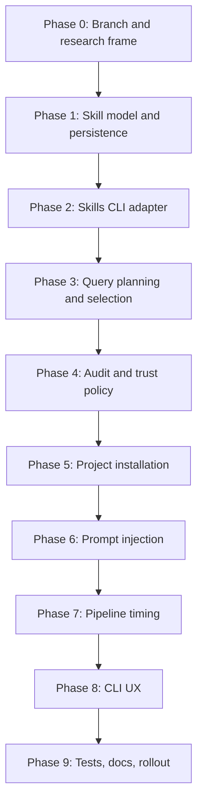

# Skills.sh Context System Master Plan

> Status: research and planning. Do not implement feature code until the relevant research gates are closed and the phase note is implementation-ready.

## Goal

Add a skills-backed context system to Forge so the CLI can discover relevant skills from Vercel's `skills` ecosystem, audit them, install approved skills into the generated project workspace, and inject selected skill guidance into Forge agent prompts for the current run.

The feature lives on branch `feature/skills-sh-context`.

> [!warning] Research Gate
> This note is the master map only. Do not implement from it directly. Each phase note must be expanded with targeted research and implementation-ready detail before code edits.
> [!tip] Vault Navigation
> Use [[Skills.sh Context System Phases|the phase tracker]] to view phase status in Obsidian Bases. Phase notes live under `skills-sh-context-phases/` and link back here.

## Research Baseline

- Vercel's `skills` CLI is the first implementation target. It supports discovery, installation, project/global scopes, `skills use` prompt generation, and agent-targeted installs.
- The first version will use CLI-only integration rather than the authenticated skills.sh API.
- OpenCode exposes compact available-skill metadata and loads full skill content on demand through a native skill tool.
- Hermes uses progressive disclosure: compact skill list first, then full `SKILL.md`, then supporting files only when needed.
- Third-party skills must be treated as untrusted operational prompt text. Audit and instruction-boundary handling are part of the feature, not optional polish.

Source links for follow-up research:

- https://github.com/vercel-labs/skills
- https://www.skills.sh/docs/cli
- https://www.skills.sh/docs/api
- https://dev.opencode.ai/docs/skills
- https://hermes-agent.nousresearch.com/docs/developer-guide/creating-skills
- https://github.com/NousResearch/hermes-agent/blob/main/website/docs/guides/work-with-skills.md

## Core Decisions

- Discovery source: CLI-only first, using `npx skills`.
- Usage mode: mixed. Forge installs selected skills into the project workspace and injects selected skill context into current agent prompts.
- Selection policy: automatic with audit, logging every query, candidate, skip, selection, install, and injection decision.
- Install scope: project only. No global installs in v1.
- Install method: copied skill files preferred over symlink-only behavior.
- Prompt authority: skill text is guidance only and cannot override Forge, system, developer, or user instructions.
- Runtime shape: progressive disclosure where possible; avoid dumping full skill libraries into every prompt.

## Phase Map

### Phase 0: Branch, Documentation, And Research Frame

- 0.1 Branch setup
  - 0.1.1 Create feature branch.
  - 0.1.2 Preserve unrelated working tree changes.
- 0.2 Master documentation
  - 0.2.1 Capture feature decisions.
  - 0.2.2 Capture research sources.
  - 0.2.3 Establish phase-note naming and supporting-plan rules.
- 0.3 Research discipline
  - 0.3.1 Define research questions before each phase note is implemented.
  - 0.3.2 Record external behavior with citations or local command output.
  - 0.3.3 Require an implementation-ready phase note before code edits.

### Phase 1: Skill Model, Config, And Session Persistence

- 1.1 Domain model
  - 1.1.1 Candidate shape.
  - 1.1.2 Selection shape.
  - 1.1.3 Audit shape.
  - 1.1.4 Install and injection shape.
- 1.2 Config model
  - 1.2.1 Feature enablement.
  - 1.2.2 Max skills and prompt budgets.
  - 1.2.3 Trusted source policy.
  - 1.2.4 Project install target policy.
- 1.3 Persistence model
  - 1.3.1 Session-level skill state.
  - 1.3.2 Candidate and audit history.
  - 1.3.3 Resume behavior.

### Phase 2: Vercel Skills CLI Adapter

- 2.1 Command contract research
  - 2.1.1 `skills find` behavior.
  - 2.1.2 `skills use` prompt shape.
  - 2.1.3 `skills add` project install behavior.
  - 2.1.4 `skills list --json` installed inventory shape.
- 2.2 Adapter design
  - 2.2.1 Safe process spawning.
  - 2.2.2 Timeout and retry policy.
  - 2.2.3 ANSI stripping and parser policy.
  - 2.2.4 Telemetry environment policy.
- 2.3 Test strategy
  - 2.3.1 Fake `skills` binary.
  - 2.3.2 Fixture outputs.
  - 2.3.3 Failure mode fixtures.

### Phase 3: Query Planning, Ranking, And Selection

- 3.1 Query planner
  - 3.1.1 Idea-derived queries.
  - 3.1.2 Spec-derived queries.
  - 3.1.3 Architecture-derived queries.
  - 3.1.4 Failure-derived queries.
- 3.2 Ranking
  - 3.2.1 Relevance scoring.
  - 3.2.2 Source reputation scoring.
  - 3.2.3 Install-count scoring.
  - 3.2.4 Redundancy and duplicate handling.
- 3.3 Selection
  - 3.3.1 Max skill count.
  - 3.3.2 Phase-specific selection.
  - 3.3.3 Already-installed reuse.

### Phase 4: Skill Audit And Trust Policy

- 4.1 Threat model research
  - 4.1.1 Prompt injection patterns.
  - 4.1.2 Destructive command patterns.
  - 4.1.3 Exfiltration and credential-access patterns.
  - 4.1.4 Dependency and script risks.
- 4.2 Static audit policy
  - 4.2.1 Pass/warn/fail verdicts.
  - 4.2.2 Hard-block rules.
  - 4.2.3 Warn-and-skip rules for auto mode.
  - 4.2.4 Audit log shape.
- 4.3 Override policy
  - 4.3.1 No override in auto mode.
  - 4.3.2 Future manual review path.
  - 4.3.3 Risk messaging.

### Phase 5: Project Installation And Workspace Layout

- 5.1 Install target research
  - 5.1.1 Forge-native `.forge/skills`.
  - 5.1.2 Shared `.agents/skills`.
  - 5.1.3 External-agent compatibility paths.
- 5.2 Install execution
  - 5.2.1 Project-scope install.
  - 5.2.2 Copy-vs-symlink behavior.
  - 5.2.3 Verification after install.
  - 5.2.4 Cleanup and rollback on failure.
- 5.3 Installed inventory
  - 5.3.1 Read installed skill frontmatter.
  - 5.3.2 Deduplicate names.
  - 5.3.3 Persist selected inventory.

### Phase 6: Prompt Injection And Progressive Disclosure

- 6.1 Context provider
  - 6.1.1 Compact skill list.
  - 6.1.2 Full skill context.
  - 6.1.3 Supporting file references.
- 6.2 Forge-native tool-loop integration
  - 6.2.1 `skill_list` tool.
  - 6.2.2 `skill_read` tool.
  - 6.2.3 Tool-call logging.
- 6.3 One-shot and external-agent integration
  - 6.3.1 One-shot prompt injection.
  - 6.3.2 Codex CLI prompt injection.
  - 6.3.3 Claude Code prompt injection.
  - 6.3.4 Installed project skill discovery for external agents.
- 6.4 Prompt safety
  - 6.4.1 Instruction boundary wrapper.
  - 6.4.2 Token and character caps.
  - 6.4.3 Conflict handling.

### Phase 7: Pipeline Timing And Agent Behavior

- 7.1 Ideation-to-architecture timing
  - 7.1.1 Broad early discovery.
  - 7.1.2 Architecture guidance injection.
- 7.2 Architecture-to-coding timing
  - 7.2.1 Stack-specific discovery.
  - 7.2.2 Task-specific injection.
- 7.3 Verification-loop timing
  - 7.3.1 Failure-specific discovery.
  - 7.3.2 Debugging and testing skills.
  - 7.3.3 Cycle-to-cycle reuse.
- 7.4 Live events
  - 7.4.1 Selected skill event.
  - 7.4.2 Skipped skill event.
  - 7.4.3 Install and injection event.

### Phase 8: CLI UX, Setup, And User Controls

- 8.1 Build command flags
  - 8.1.1 `--skills auto|off`.
  - 8.1.2 `--skills-max`.
  - 8.1.3 Future dry-run flag.
- 8.2 Setup wizard
  - 8.2.1 Opt-in setting.
  - 8.2.2 Trust-policy explanation.
  - 8.2.3 Telemetry explanation.
- 8.3 Future skill commands
  - 8.3.1 `forgecli skills search`.
  - 8.3.2 `forgecli skills list`.
  - 8.3.3 `forgecli skills audit`.
  - 8.3.4 `forgecli skills explain`.

### Phase 9: Test Matrix, Documentation, And Rollout

- 9.1 Unit tests
  - 9.1.1 Adapter tests.
  - 9.1.2 Scoring tests.
  - 9.1.3 Audit tests.
  - 9.1.4 Prompt rendering tests.
- 9.2 Integration tests
  - 9.2.1 Fake skills CLI in PATH.
  - 9.2.2 Pipeline with selected skills.
  - 9.2.3 Resume behavior.
  - 9.2.4 External-agent prompt behavior.
- 9.3 Docs
  - 9.3.1 README feature section.
  - 9.3.2 Safety and privacy notes.
  - 9.3.3 Troubleshooting.
- 9.4 Rollout
  - 9.4.1 Disabled-by-default alpha.
  - 9.4.2 Opt-in beta.
  - 9.4.3 Default-on criteria.

## Phase Note Rules

- Each phase note becomes the detailed implementation plan only after targeted research is complete.
- Each implementation-ready phase note must name exact repo files, interfaces, tests, and acceptance criteria.
- Each implementation-ready phase note must be small enough to implement independently.
- Optional supporting plans are allowed only when a phase note becomes too large or when a decision spans phases.
- Each subsubplan must resolve one decision cluster, not a whole feature area.
- No implementation code should be written from this master plan alone.

## Open Research Questions

- What exact machine-readable output can be relied on from `npx skills find`, if any?
- Which `skills add` arguments produce the cleanest project-local install for `.forge/skills` and `.agents/skills`?
- Should Forge maintain its own `.forge/skills-lock.json`, rely on upstream `skills-lock.json`, or store everything in SQLite?
- How should Forge expose skill references to external agents without overloading their prompt context?
- What audit threshold is strict enough for automatic mode without making the feature useless?
- How should skill selection differ between generated app workspaces and Forge's own repo when users ask Forge to modify itself?
