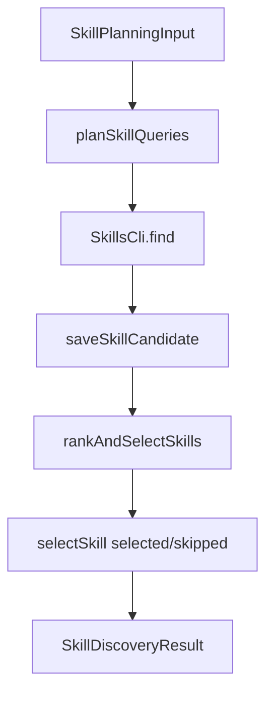

# Phase 3 - Query Planning Ranking Selection

> [!warning] Scope Boundary
> Phase 3 decides which skill candidates are worth considering. It must not audit skill contents, install skills, inject prompts, or change when Forge calls skill discovery in the pipeline.

> [!abstract] Outcome
> At the end of Phase 3, Forge can derive deterministic search queries from session context, run them through the Phase 2 CLI adapter, score returned candidates, deduplicate them, and produce a bounded list of selected candidates for Phase 4 audit.

> [!important] Implementation Status
> This note is complete as the Phase 3 implementation contract. The branch planner, scoring, and discovery modules exist, but they are not yet complete against this contract; the source audit below lists the exact corrections still required before Phase 3 can be considered implemented.

## Research Questions

- Which Forge data is available before architecture, before coding, and after verification failures?
- What do representative `skills find` results look like for common Forge tasks?
- Are install counts high enough to use a simple popularity threshold?
- What deterministic scoring signals are available before downloading/auditing full skill content?
- How should Forge avoid selecting duplicates across repeated queries and resume runs?
- What should Phase 3 persist for later explanation and debugging?

## Researched Facts

### Evidence: Current Branch And Dirty State

Command:

```bash
git status --short --branch
```

Observed:

```text
## feature/skills-sh-context
?? .env
?? docs/plans/2026-06-06-skills-sh-context.md
?? "docs/plans/Skills.sh Context System Phases.base"
?? docs/plans/skills-sh-context-phases/
?? pyproject.toml
?? tests/test_cli.py
```

Interpretation:

- Work is on `feature/skills-sh-context`.
- `.env`, `pyproject.toml`, and `tests/test_cli.py` are unrelated untracked files and must not be touched by Phase 3.

### Evidence: Forge Pipeline Inputs

Files inspected:

- `src/agents/ideation.ts`
- `src/agents/architecture.ts`
- `src/agents/taskGraph.ts`
- `src/overseer.ts`

Current data shapes:

```json
{
  "spec": {
    "name": "kebab-case-name",
    "description": "one paragraph",
    "tech_stack": ["list"],
    "features": ["list"],
    "out_of_scope": ["list"],
    "assumptions": ["list of assumptions made"]
  },
  "architecture": {
    "stack": {
      "language": "...",
      "framework": "...",
      "database": "...",
      "extras": []
    },
    "structure": ["list of key file paths / dirs"],
    "deploy_platforms": ["vercel|railway|fly.io|none"],
    "test_framework": "pytest|vitest|go-test|jest|...",
    "verification_method": "web|api|cli"
  },
  "task": {
    "title": "imperative title",
    "type": "coding",
    "deps": ["list of titles this depends on"]
  },
  "verification_report": {
    "passed": [],
    "failed": ["failure strings"],
    "errors": ["error strings"]
  }
}
```

Plan impact:

- Phase 3 should accept raw `idea`, parsed or raw `spec`, parsed or raw `architecture`, task titles, and verification failures.
- The query planner must tolerate malformed JSON by falling back to raw text token extraction.
- Pipeline timing is Phase 7, but Phase 3 should expose inputs flexible enough for Phase 7 to call it at several points.

### Evidence: Phase 1 And Phase 2 Dependencies

Phase 1 planned:

- `SkillConfig`
- `SkillCandidate`
- SQLite helpers for queries, candidates, audits, selections, installs, and injections

Phase 2 planned:

- `SkillsCli.find(query, workspace): Promise<SkillsFindResult>`
- `parseFindOutput()` returns `SkillCandidate[]`
- `skills find` output has no descriptions and uses human text parsing

Plan impact:

- Phase 3 should not define a second candidate model.
- Phase 3 should treat candidate descriptions from `find` as optional or empty.
- Phase 3 should persist the queries and candidates using Phase 1 DB methods.

### Evidence: Upstream Search Behavior

Sources:

- [vercel-labs/skills `find.ts`](https://github.com/vercel-labs/skills/blob/main/src/find.ts)
- [skills.sh API docs](https://www.skills.sh/docs/api)

Findings:

- The CLI `find` implementation searches skills and prints up to six non-interactive results.
- The implementation sorts returned search results by installs before printing.
- API docs say search can match by name, source, or description; multi-word queries use semantic search in the documented v1 endpoint.
- Phase 2 still uses the CLI, not direct API access.

Plan impact:

- Search result order is useful but not enough; Forge should rescore locally.
- Multi-word queries like `react testing` and `vercel deployment` are valuable and should be preferred over single-word queries.
- Because the CLI only prints up to six results, query choice is critical.

### Evidence: 2026-06-07 Upstream Refresh

Sources checked:

- [skills.sh API docs](https://www.skills.sh/docs/api)
- [vercel-labs/skills raw `find.ts`](https://raw.githubusercontent.com/vercel-labs/skills/main/src/find.ts)

Findings:

- The current API docs still describe search by name, source, or description.
- The current API docs still distinguish single-word fuzzy search from multi-word semantic search.
- Current upstream `find` still performs API-backed search internally and prints human-oriented results for CLI users.
- Phase 2 remains the only phase that wraps the CLI; Phase 3 should not call API endpoints directly.

Plan impact:

- Keep multi-word query planning as the default for meaningful domains such as `react testing`, `frontend design`, and `vercel deployment`.
- Keep local ranking even when upstream result order looks useful; installs and semantic relevance are upstream hints, not Forge's final selection policy.
- Keep network/search failure handling local to discovery so later pipeline phases can continue through a no-skills path.

## Representative Search Output Research

All commands used:

```bash
env DISABLE_TELEMETRY=1 NO_COLOR=1 npx --yes skills find <query>
```

### Frontend Design

Query:

```bash
skills find frontend design
```

Observed after ANSI stripping:

```text
ulpi-io/skills@frontend-design-ui-ux 258 installs
rand/cc-polymath@discover-frontend 103 installs
cowork-os/cowork-os@frontend-design 39 installs
udecode/plate@frontend-design-frontend-design 23 installs
```

Finding:

- Frontend results can be relevant with only 100-300 installs.
- A hard 1,000-install cutoff would remove most frontend-design candidates.

### React Testing

Query:

```bash
skills find react testing
```

Observed after ANSI stripping:

```text
github/awesome-copilot@react19-test-patterns 727 installs
affaan-m/everything-claude-code@react-testing 244 installs
citypaul/.dotfiles@react-testing 92 installs
majesticlabs-dev/majestic-marketplace@react-testing 60 installs
claude-dev-suite/claude-dev-suite@react-testing 37 installs
thebushidocollective/han@react-native-web-testing 33 installs
```

Finding:

- The strongest testing result is below 1,000 installs.
- Owner reputation and relevance matter alongside install count.

### Vercel Deployment

Query:

```bash
skills find vercel deployment
```

Observed after ANSI stripping:

```text
vercel-labs/agent-skills@deploy-to-vercel 66K installs
bytedance/deer-flow@vercel-deploy 1.3K installs
vercel/vercel-plugin@deployments-cicd 504 installs
vercel/vercel-plugin@vercel-cli 450 installs
vercel-labs/vercel-plugin@deployments-cicd 353 installs
vercel-labs/vercel-plugin@vercel-cli 289 installs
```

Finding:

- Deployment/platform queries often surface strong official or near-official sources.
- Trusted source boost should matter here.

### Documentation

Query:

```bash
skills find documentation readme
```

Observed after ANSI stripping:

```text
trkbt10/indexion-skills@indexion-readme 1.2K installs
gohypergiant/agent-skills@accelint-readme-writer 192 installs
tony363/superclaude@sc-readme 56 installs
```

Finding:

- Documentation results are sparse.
- Phase 3 should avoid consuming all max skill slots with docs unless the project explicitly asks for docs.

### Debugging Build Errors

Query:

```bash
skills find debugging build errors
```

Observed after ANSI stripping:

```text
webflow/webflow-skills@webflow-cli:troubleshooter 408 installs
mohitmishra786/low-level-dev-skills@zig-debugging 155 installs
cowork-os/cowork-os@debug-error 48 installs
rajavijayach/electrobun-skills@electrobun-debugging 47 installs
snakeo/claude-debug-and-refactor-skills-plugin@debug:flutter 40 installs
snakeo/claude-debug-and-refactor-skills-plugin@debug:nextjs 27 installs
```

Finding:

- Generic debugging queries can return stack-specific mismatches.
- Failure-derived queries should include stack/framework terms, for example `nextjs build error` instead of only `debugging build errors`.

## Selection Policy

### Core Policy

- Query planning is deterministic.
- Candidate scoring is deterministic.
- LLMs are not used to choose skills in Phase 3.
- Install count is a signal, not an absolute gate.
- Unknown low-install sources are not automatically selected unless relevance is very high; Phase 4 may still reject them.
- A Phase 3 "selected" candidate means "selected for audit", not "approved for prompt injection or installation".

### Default Thresholds

These defaults should come from `SkillConfig` where available and from Phase 3 input options where they are query-specific:

```typescript
const DEFAULT_MAX_QUERIES = 8;
const DEFAULT_MAX_CANDIDATES_PER_QUERY = 6;
const DEFAULT_SCORE_THRESHOLD = 0.62;
const DEFAULT_MIN_INSTALL_COUNT = 100;
const DEFAULT_MAX_SKILLS = 3;
```

Threshold rationale:

- `100` installs keeps observed frontend/testing/debugging candidates available.
- `0.62` score requires more than one good signal.
- `maxSkills = 3` prevents noisy prompt/install plans and matches Phase 1 config.

Threshold implementation notes:

- `DEFAULT_MAX_CANDIDATES_PER_QUERY` must be enforced in `discoverSkillCandidates()` by slicing each CLI result before saving candidates. If the CLI continues to return exactly six results, keeping the limit explicit still protects direct-test clients and future adapter changes.
- `DEFAULT_SCORE_THRESHOLD` must be exposed as `SkillRankingInput.scoreThreshold` and passed through from `SkillDiscoveryInput.scoreThreshold`. Phase 8 can later wire it to TOML or a CLI flag without changing the scoring contract.
- `DEFAULT_MIN_INSTALL_COUNT` and `DEFAULT_MAX_SKILLS` should continue to come from `SkillConfig`.

## File Map

| File | Action | Responsibility |
|---|---|---|
| `src/skills/planner.ts` | Create or revise | Derive weighted search queries from idea/spec/architecture/tasks/failures |
| `src/skills/scoring.ts` | Create or revise | Score, rank, deduplicate, and select candidates |
| `src/skills/discovery.ts` | Create or revise | Orchestrate `SkillsCli.find`, DB logging, scoring, and selection intent |
| `tests/skillsPlanner.test.ts` | Create or revise | Unit tests for deterministic query generation |
| `tests/skillsScoring.test.ts` | Create or revise | Unit tests for scoring, thresholds, dedupe, max skill limit |
| `tests/skillsDiscovery.test.ts` | Create or revise | Unit tests with fake search client and fake DB methods |
| `docs/plans/skills-sh-context-phases/Phase 3 - Query Planning Ranking Selection.md` | Maintain | This implementation-ready plan |

## Review Amendments Applied To This Plan

- Phase status is set to `ready` because the plan is now implementation-ready, while source completion remains tracked by unchecked implementation criteria.
- Per-query candidate limiting is explicit in `SkillDiscoveryInput.maxCandidatesPerQuery` and enforced before candidates are saved.
- Score threshold is explicit in `SkillRankingInput.scoreThreshold` and `SkillDiscoveryInput.scoreThreshold`; Phase 8 can later expose it through user-facing config.
- Tokenization splits slug-like names on hyphens, underscores, slashes, and punctuation so real `skills.sh` skill names score correctly.
- `build` is not a stop word; failure-derived discovery must preserve terms like `build`, `test`, `debug`, and `deploy`.
- Source reputation derives the owner from `packageRef` instead of requiring the removed `sourceOwner` field.
- Resume dedupe uses a join-backed `getSkillSelectionKeys(sessionId)` helper rather than reading missing `package_ref` or `skill_key` columns from raw selection rows.
- Discovery writes include `attempt` for query logs and selection logs.
- Ranking carries `candidateId` so duplicate candidates across queries persist the highest-ranked occurrence, not the first saved occurrence.
- Discovery returns recoverable per-query failures so Phase 3 can degrade to a no-skills path when the Phase 2 CLI adapter reports network/search errors.
- Implementation tasks and acceptance criteria stay unchecked until source code reflects these corrections.

## Current Source Audit

Checked on 2026-06-07 against the current branch:

| Area | Current Branch State | Required Correction |
|---|---|---|
| `src/skills/planner.ts` | Planner exists and covers the main query sources, but its local `STOP_WORDS` still includes `build` and its tokenization does not split hyphenated/slash-delimited slugs | Remove task-intent words from stop words and use the slug-aware normalization in this note |
| `src/skills/scoring.ts` | Ranking exists, but `SkillRankingInput` does not carry `candidateId`, tokenization does not split slugs, optional `title`/`description` are not null-safe, and source reputation still reads `candidate.sourceOwner` | Align scoring with the revised loose Phase 1/2 candidate model and preserve `candidateId` on ranked rows |
| `src/skills/discovery.ts` | Discovery exists, but `SkillDiscoveryInput` lacks `attempt`, DB logging lacks attempt, candidate limits are not enforced, score threshold is not passed through, existing selection keys are read from raw rows that do not contain skill identity, and duplicate persistence uses `pairs.find(...)` | Replace with the attempt-aware orchestrator contract in this note |
| `src/skills/discovery.ts` failure handling | `client.find()` failures currently reject the whole discovery call | Catch search/client failures per query and return recoverable `SkillDiscoveryFailure[]` while preserving DB failures as hard errors |
| `tests/skillsScoring.test.ts` | Tests still construct candidates with `sourceOwner` and do not cover slug-aware relevance, packageRef-derived source trust, or `candidateId` preservation | Add or revise scoring tests listed below |
| `tests/skillsDiscovery.test.ts` | Fake DB and tests still use `getSkillSelections()`, no attempt field, no max-candidate limit, no duplicate highest-ranked candidate assertion, and no recoverable failure assertion | Add or revise discovery tests listed below |

This audit means Phase 3 is complete as a plan, not complete as implemented code.

## Public Interfaces

### Query Planning Types

```typescript
export type SkillQuerySource =
  | "idea"
  | "spec"
  | "architecture"
  | "task"
  | "failure";

export interface PlannedSkillQuery {
  query: string;
  source: SkillQuerySource;
  phase: string;
  reason: string;
  weight: number;
}

export interface SkillPlanningInput {
  phase: string;
  idea?: string;
  spec?: string | Record<string, unknown>;
  architecture?: string | Record<string, unknown>;
  tasks?: Array<{ id?: string; title: string; type?: string }>;
  failures?: string[];
  maxQueries?: number;
}
```

### Query Planner API

```typescript
export function planSkillQueries(input: SkillPlanningInput): PlannedSkillQuery[];
```

Example:

```typescript
const queries = planSkillQueries({
  phase: "CODING",
  idea: "a React dashboard for GitHub repo stats",
  spec: {
    tech_stack: ["React", "TypeScript"],
    features: ["charts", "GitHub API integration"],
  },
  architecture: {
    stack: {
      language: "TypeScript",
      framework: "Vite+React",
      database: "none",
      extras: ["Recharts"],
    },
    deploy_platforms: ["vercel"],
    test_framework: "vitest",
    verification_method: "web",
  },
  tasks: [{ title: "Build repository stats dashboard UI" }],
});
```

Expected planned queries:

```typescript
[
  { query: "react frontend", source: "architecture", phase: "CODING", reason: "framework Vite+React", weight: 1 },
  { query: "typescript react", source: "architecture", phase: "CODING", reason: "language plus framework", weight: 0.9 },
  { query: "vitest testing", source: "architecture", phase: "CODING", reason: "test framework", weight: 0.7 },
  { query: "vercel deployment", source: "architecture", phase: "CODING", reason: "deploy target", weight: 0.6 },
  { query: "github api", source: "spec", phase: "CODING", reason: "feature keyword", weight: 0.6 }
]
```

### Scoring Types

```typescript
import type { SkillCandidate, SkillConfig } from "./types.js";

export interface SkillScoreBreakdown {
  relevance: number;
  sourceReputation: number;
  installPopularity: number;
  phaseFit: number;
  duplicatePenalty: number;
  total: number;
}

export interface SkillCandidateForRanking {
  candidate: SkillCandidate;
  query: PlannedSkillQuery;
  candidateId?: string;
}

export interface RankedSkillCandidate {
  candidate: SkillCandidate;
  query: PlannedSkillQuery;
  candidateId?: string;
  score: SkillScoreBreakdown;
  selected: boolean;
  skipReason?: string;
}

export interface SkillRankingInput {
  candidates: SkillCandidateForRanking[];
  config: SkillConfig;
  existingSkillKeys?: Set<string>;
  maxSkills?: number;
  scoreThreshold?: number;
}
```

### Scoring API

```typescript
export function scoreSkillCandidate(
  candidate: SkillCandidate,
  query: PlannedSkillQuery,
  config: SkillConfig,
  existingSkillKeys?: Set<string>,
): SkillScoreBreakdown;

export function rankAndSelectSkills(input: SkillRankingInput): RankedSkillCandidate[];
```

### Discovery Orchestrator Types

```typescript
export interface SkillSearchClient {
  find(query: string, workspace: string): Promise<{
    query: string;
    candidates: SkillCandidate[];
    rawOutput: string;
  }>;
}

export interface SkillDiscoveryInput extends SkillPlanningInput {
  sessionId: string;
  workspace: string;
  attempt: number;
  config: SkillConfig;
  maxCandidatesPerQuery?: number;
  scoreThreshold?: number;
}

export interface SkillDiscoveryFailure {
  query: PlannedSkillQuery;
  message: string;
  recoverable: boolean;
}

export interface SkillDiscoveryResult {
  queries: PlannedSkillQuery[];
  ranked: RankedSkillCandidate[];
  selected: RankedSkillCandidate[];
  failures: SkillDiscoveryFailure[];
}

export interface SkillDiscoveryDb {
  logSkillQuery(sessionId: string, phase: string, query: string, attempt: number): string;
  saveSkillCandidate(sessionId: string, queryId: string | undefined, candidate: SkillCandidate): string;
  selectSkill(sessionId: string, selection: {
    candidateId: string;
    status: "selected" | "skipped";
    phase: string;
    attempt: number;
    taskId?: string;
    rationale: string;
  }): string;
  getSkillSelectionKeys(sessionId: string): string[];
}
```

Orchestrator API:

```typescript
export async function discoverSkillCandidates(
  input: SkillDiscoveryInput,
  client: SkillSearchClient,
  db: SkillDiscoveryDb,
): Promise<SkillDiscoveryResult>;
```

## Query Planner Design

### Normalization

```typescript
const STOP_WORDS = new Set([
  "a", "an", "and", "app", "application", "create",
  "for", "of", "the", "to", "with",
]);

function words(text: string): string[] {
  return text
    .toLowerCase()
    .replace(/[-_/]+/g, " ")
    .replace(/[^a-z0-9+#. ]+/g, " ")
    .split(/\s+/)
    .filter((w) => w.length >= 2 && !STOP_WORDS.has(w));
}
```

Normalization notes:

- Do not include task-intent terms like `build`, `test`, `debug`, `deploy`, or `search` in `STOP_WORDS`; they are meaningful when failures drive discovery.
- Split hyphenated, underscored, and slash-delimited slugs before scoring. Most real `skills.sh` names are slug-like, so `react-frontend`, `vtex-io-react-apps`, and `debug:nextjs` must still produce useful token overlap.

### Safe JSON Parsing

```typescript
function objectFromMaybeJson(value: string | Record<string, unknown> | undefined): Record<string, unknown> {
  if (!value) return {};
  if (typeof value === "object") return value;
  try {
    const parsed = JSON.parse(value);
    return parsed && typeof parsed === "object" ? parsed as Record<string, unknown> : {};
  } catch {
    return { raw: value };
  }
}
```

### Query Rules

Framework rules:

```typescript
const FRAMEWORK_QUERIES: Array<[RegExp, string[]]> = [
  [/next\.?js|next/i, ["nextjs", "react frontend"]],
  [/vite.*react|react.*vite|react/i, ["react frontend", "typescript react"]],
  [/vue/i, ["vue frontend"]],
  [/svelte/i, ["svelte frontend"]],
  [/fastapi/i, ["fastapi python"]],
  [/express|node/i, ["nodejs backend", "express api"]],
];
```

Feature/domain rules:

```typescript
const DOMAIN_QUERIES: Array<[RegExp, string[]]> = [
  [/landing|website|frontend|ui|ux|dashboard/i, ["frontend design"]],
  [/accessibility|a11y/i, ["accessibility frontend"]],
  [/auth|login|oauth|jwt/i, ["authentication security"]],
  [/database|postgres|sqlite|supabase/i, ["database", "supabase"]],
  [/test|testing|e2e|playwright|vitest|jest/i, ["testing", "playwright testing"]],
  [/deploy|deployment|vercel|railway|fly/i, ["deployment"]],
  [/readme|documentation|docs/i, ["documentation readme"]],
];
```

Architecture rules:

```typescript
function queriesFromArchitecture(architecture: Record<string, unknown>, phase: string): PlannedSkillQuery[] {
  const stack = (architecture["stack"] ?? {}) as Record<string, unknown>;
  const framework = String(stack["framework"] ?? "");
  const language = String(stack["language"] ?? "");
  const database = String(stack["database"] ?? "");
  const extras = Array.isArray(stack["extras"]) ? stack["extras"].map(String) : [];
  const testFramework = String(architecture["test_framework"] ?? "");
  const deployPlatforms = Array.isArray(architecture["deploy_platforms"])
    ? architecture["deploy_platforms"].map(String)
    : [];

  const queries: PlannedSkillQuery[] = [];
  addRuleQueries(queries, `${framework} ${language}`, FRAMEWORK_QUERIES, "architecture", phase, 1.0);
  if (testFramework) queries.push(q(`${testFramework} testing`, "architecture", phase, "test framework", 0.75));
  for (const platform of deployPlatforms.filter((p) => p !== "none")) {
    queries.push(q(`${platform} deployment`, "architecture", phase, "deploy target", 0.65));
  }
  if (database && database !== "none") {
    queries.push(q(`${database} database`, "architecture", phase, "database", 0.6));
  }
  for (const extra of extras.slice(0, 3)) {
    queries.push(q(extra, "architecture", phase, "stack extra", 0.45));
  }
  return queries;
}
```

Failure rules:

```typescript
const FAILURE_QUERY_RULES: Array<[RegExp, string]> = [
  [/build|compile|tsc|typescript/i, "typescript build errors"],
  [/test|assert|expect|jest|vitest|pytest/i, "testing failures"],
  [/playwright|browser|locator/i, "playwright testing"],
  [/deploy|vercel|railway|fly/i, "deployment troubleshooting"],
  [/import|module|resolve/i, "module resolution debugging"],
  [/css|layout|responsive|mobile/i, "frontend design debugging"],
];
```

Dedup and budget:

```typescript
function dedupeAndLimit(queries: PlannedSkillQuery[], maxQueries: number): PlannedSkillQuery[] {
  const seen = new Set<string>();
  return queries
    .sort((a, b) => b.weight - a.weight)
    .filter((item) => {
      const key = item.query.toLowerCase().trim();
      if (seen.has(key)) return false;
      seen.add(key);
      return true;
    })
    .slice(0, maxQueries);
}
```

## Scoring Design

### Candidate Key

```typescript
export function skillKey(candidate: SkillCandidate): string {
  return `${candidate.packageRef}@${candidate.skillName}`.toLowerCase();
}
```

### Relevance Score

Use available candidate text:

- `skillName`
- `title`
- `description`
- `packageRef`
- `url`

```typescript
function relevanceScore(candidate: SkillCandidate, query: PlannedSkillQuery): number {
  const queryTokens = new Set(words(query.query));
  const candidateText = [
    candidate.skillName,
    candidate.title ?? "",
    candidate.description ?? "",
    candidate.packageRef,
    candidate.url ?? "",
  ].join(" ");
  const candidateTokens = new Set(words(candidateText));

  let hits = 0;
  for (const token of queryTokens) if (candidateTokens.has(token)) hits++;

  const overlap = queryTokens.size ? hits / queryTokens.size : 0;
  const exactSlug = candidate.skillName.toLowerCase().includes(query.query.toLowerCase().replace(/\s+/g, "-")) ? 0.25 : 0;
  return clamp(overlap + exactSlug, 0, 1);
}
```

### Source Reputation Score

```typescript
function candidateOwner(candidate: SkillCandidate): string {
  return candidate.packageRef.split("/")[0]?.toLowerCase() ?? "";
}

function sourceReputationScore(candidate: SkillCandidate, config: SkillConfig): number {
  const owner = candidateOwner(candidate);
  const source = candidate.packageRef.toLowerCase();
  if (config.trustedSources.map((s) => s.toLowerCase()).includes(owner)) return 1;
  if (config.trustedSources.some((s) => source.startsWith(`${s.toLowerCase()}/`))) return 1;
  if ((candidate.installCount ?? 0) >= 10_000) return 0.75;
  if ((candidate.installCount ?? 0) >= 1_000) return 0.55;
  return 0.25;
}
```

### Install Popularity Score

```typescript
function installPopularityScore(candidate: SkillCandidate): number {
  const installs = Math.max(0, candidate.installCount ?? 0);
  if (installs === 0) return 0;
  return clamp(Math.log10(installs + 1) / 5, 0, 1);
}
```

### Phase Fit Score

```typescript
function phaseFitScore(candidate: SkillCandidate, query: PlannedSkillQuery): number {
  const text = `${candidate.skillName} ${candidate.title ?? ""} ${candidate.description ?? ""}`.toLowerCase();
  if (query.phase === "ARCHITECTURE" && /architecture|design|stack|frontend|backend|database/.test(text)) return 1;
  if (query.phase === "CODING" && /react|next|typescript|python|api|frontend|backend|database/.test(text)) return 0.85;
  if (query.phase === "TESTING" && /test|testing|playwright|jest|vitest|pytest/.test(text)) return 1;
  if (query.phase === "VERIFICATION" && /debug|troubleshoot|build|test|deploy|verify/.test(text)) return 1;
  if (query.phase === "DEPLOY" && /deploy|vercel|railway|fly|ci/.test(text)) return 1;
  return 0.5;
}
```

### Total Score

```typescript
export function scoreSkillCandidate(
  candidate: SkillCandidate,
  query: PlannedSkillQuery,
  config: SkillConfig,
  existingSkillKeys = new Set<string>(),
): SkillScoreBreakdown {
  const relevance = relevanceScore(candidate, query);
  const sourceReputation = sourceReputationScore(candidate, config);
  const installPopularity = installPopularityScore(candidate);
  const phaseFit = phaseFitScore(candidate, query);
  const duplicatePenalty = existingSkillKeys.has(skillKey(candidate)) ? 1 : 0;

  const total = clamp(
    relevance * 0.35 +
    sourceReputation * 0.25 +
    installPopularity * 0.20 +
    phaseFit * 0.15 +
    query.weight * 0.05 -
    duplicatePenalty * 0.75,
    0,
    1,
  );

  return { relevance, sourceReputation, installPopularity, phaseFit, duplicatePenalty, total };
}
```

### Selection Rules

```typescript
export function rankAndSelectSkills(input: SkillRankingInput): RankedSkillCandidate[] {
  const maxSkills = input.maxSkills ?? input.config.maxSkills;
  const threshold = input.scoreThreshold ?? DEFAULT_SCORE_THRESHOLD;
  const seen = new Set<string>();

  const ranked = input.candidates
    .map(({ candidate, query, candidateId }) => ({
      candidate,
      query,
      candidateId,
      score: scoreSkillCandidate(candidate, query, input.config, input.existingSkillKeys),
      selected: false,
    }))
    .sort((a, b) => b.score.total - a.score.total);

  let selectedCount = 0;
  for (const item of ranked) {
    const key = skillKey(item.candidate);
    if (seen.has(key)) {
      item.skipReason = "duplicate candidate";
      continue;
    }
    seen.add(key);

    if (item.score.total < threshold) {
      item.skipReason = `score below threshold ${threshold}`;
      continue;
    }

    if ((item.candidate.installCount ?? 0) < input.config.minInstallCount && item.score.sourceReputation < 1) {
      item.skipReason = `install count below ${input.config.minInstallCount}`;
      continue;
    }

    if (selectedCount >= maxSkills) {
      item.skipReason = `max skills ${maxSkills} reached`;
      continue;
    }

    item.selected = true;
    selectedCount++;
  }

  return ranked;
}
```

## Discovery Orchestrator Design

### Data Flow



### Orchestrator Sketch

```typescript
export async function discoverSkillCandidates(
  input: SkillDiscoveryInput,
  client: SkillSearchClient,
  db: SkillDiscoveryDb,
): Promise<SkillDiscoveryResult> {
  const attempt = Math.max(1, Math.floor(input.attempt));
  const maxCandidatesPerQuery = input.maxCandidatesPerQuery ?? DEFAULT_MAX_CANDIDATES_PER_QUERY;
  const queries = planSkillQueries(input);
  const existing = new Set(db.getSkillSelectionKeys(input.sessionId).map((key) => key.toLowerCase()));

  const pairs: Array<{ candidate: SkillCandidate; query: PlannedSkillQuery; candidateId: string }> = [];
  const failures: SkillDiscoveryFailure[] = [];

  for (const planned of queries) {
    const queryId = db.logSkillQuery(input.sessionId, planned.phase, planned.query, attempt);
    let result: Awaited<ReturnType<SkillSearchClient["find"]>>;
    try {
      result = await client.find(planned.query, input.workspace);
    } catch (err) {
      failures.push({
        query: planned,
        message: err instanceof Error ? err.message : String(err),
        recoverable: true,
      });
      continue;
    }

    for (const candidate of result.candidates.slice(0, maxCandidatesPerQuery)) {
      const candidateId = db.saveSkillCandidate(input.sessionId, queryId, candidate);
      pairs.push({ candidate, query: planned, candidateId });
    }
  }

  const ranked = rankAndSelectSkills({
    candidates: pairs,
    config: input.config,
    existingSkillKeys: existing,
    scoreThreshold: input.scoreThreshold,
  });

  for (const item of ranked) {
    if (!item.candidateId) continue;
    db.selectSkill(input.sessionId, {
      candidateId: item.candidateId,
      status: item.selected ? "selected" : "skipped",
      phase: input.phase,
      attempt,
      rationale: item.selected
        ? `score ${item.score.total.toFixed(3)} from query "${item.query.query}"`
        : item.skipReason ?? `score ${item.score.total.toFixed(3)}`,
    });
  }

  return {
    queries,
    ranked,
    selected: ranked.filter((item) => item.selected),
    failures,
  };
}
```

Notes:

- Phase 1 must expose `getSkillSelectionKeys(sessionId)` as a join-backed helper that returns exact `skillKey()` values for prior selections. Reading raw `skill_selections` rows is not enough because that table does not contain `package_ref` or `skill_key`.
- Ranking must preserve `candidateId`; do not recompute selected DB rows with `pairs.find(...)`, because duplicate candidates across queries can otherwise persist the wrong row.
- Query and selection DB writes must include `attempt` so resume runs are explainable and do not collapse into attempt `1`.
- Search/client failures should be captured in `failures` and treated as recoverable no-skills degradation. Persistence failures should still throw because they indicate Forge cannot explain or resume the session safely.
- This function selects for audit only. Phase 4 decides pass/warn/fail.
- Network behavior stays isolated behind `SkillSearchClient` for testability.

## Implementation Tasks

### Task 3.1 - Add Query Planner

Files:

- Create or revise `src/skills/planner.ts`
- Create or revise `tests/skillsPlanner.test.ts`

Tests to write first:

```typescript
test("plans React frontend queries from architecture", () => {
  const queries = planSkillQueries({
    phase: "CODING",
    architecture: {
      stack: { language: "TypeScript", framework: "Vite+React", database: "none" },
      deploy_platforms: ["vercel"],
      test_framework: "vitest",
      verification_method: "web",
    },
  });
  expect(queries.map((q) => q.query)).toContain("react frontend");
  expect(queries.map((q) => q.query)).toContain("vitest testing");
  expect(queries.map((q) => q.query)).toContain("vercel deployment");
});

test("plans failure-specific debugging queries with stack context", () => {
  const queries = planSkillQueries({
    phase: "VERIFICATION",
    architecture: { stack: { framework: "Next.js", language: "TypeScript" } },
    failures: ["npm run build failed with TypeScript module resolution error"],
  });
  expect(queries.map((q) => q.query)).toContain("typescript build errors");
  expect(queries.map((q) => q.query)).toContain("module resolution debugging");
});

test("deduplicates and limits queries by weight", () => {
  const queries = planSkillQueries({
    phase: "CODING",
    idea: "React React React dashboard",
    spec: { tech_stack: ["React"] },
    maxQueries: 2,
  });
  expect(new Set(queries.map((q) => q.query)).size).toBe(queries.length);
  expect(queries).toHaveLength(2);
});
```

Implementation steps:

- [ ] Add `SkillPlanningInput`, `PlannedSkillQuery`, and `SkillQuerySource`.
- [ ] Add JSON fallback parsing.
- [ ] Add idea/spec/architecture/task/failure rules.
- [ ] Add dedupe and max-query limiting.
- [ ] Keep all functions pure; no DB or CLI calls.

### Task 3.2 - Add Scoring And Selection

Files:

- Create or revise `src/skills/scoring.ts`
- Create or revise `tests/skillsScoring.test.ts`

Tests to write first:

```typescript
test("trusted high relevance deployment skill is selected", () => {
  const ranked = rankAndSelectSkills({
    config: {
      mode: "auto",
      maxSkills: 3,
      promptCharBudget: 12000,
      minInstallCount: 100,
      trustedSources: ["vercel-labs", "anthropics", "openai", "microsoft"],
      installTargets: ["forge", "agents"],
    },
    candidates: [{
      query: { query: "vercel deployment", source: "architecture", phase: "DEPLOY", reason: "deploy target", weight: 1 },
      candidate: {
        packageRef: "vercel-labs/agent-skills",
        skillName: "deploy-to-vercel",
        title: "deploy-to-vercel",
        description: "",
        installCount: 66000,
      },
    }],
  });
  expect(ranked[0].selected).toBe(true);
});

test("low install unknown source is skipped even when relevant", () => {
  const ranked = rankAndSelectSkills({
    config: testConfig({ minInstallCount: 100 }),
    candidates: [{
      query: { query: "frontend design", source: "spec", phase: "CODING", reason: "ui", weight: 1 },
      candidate: {
        packageRef: "unknown/repo",
        skillName: "frontend-design",
        title: "frontend-design",
        description: "",
        installCount: 12,
      },
    }],
  });
  expect(ranked[0].selected).toBe(false);
  expect(ranked[0].skipReason).toContain("install count");
});

test("selection respects maxSkills and deduplicates exact skill keys", () => {
  const candidate = {
    packageRef: "vercel-labs/agent-skills",
    skillName: "deploy-to-vercel",
    title: "deploy-to-vercel",
    description: "",
    installCount: 66000,
  };
  const ranked = rankAndSelectSkills({
    config: testConfig({ maxSkills: 1 }),
    candidates: [
      { query: q("vercel deployment"), candidate },
      { query: q("deployment"), candidate },
    ],
  });
  expect(ranked.filter((r) => r.selected)).toHaveLength(1);
  expect(ranked.some((r) => r.skipReason === "duplicate candidate")).toBe(true);
});

test("hyphenated skill names contribute relevance tokens", () => {
  const score = scoreSkillCandidate({
    packageRef: "example/react-tools",
    skillName: "react-frontend",
    title: "react-frontend",
    description: "",
    installCount: 500,
  }, q("react frontend"), testConfig());
  expect(score.relevance).toBeGreaterThan(0);
});

test("source reputation derives trusted owner from packageRef", () => {
  const ranked = rankAndSelectSkills({
    config: testConfig({ trustedSources: ["vercel-labs"] }),
    candidates: [{
      query: q("vercel deployment"),
      candidate: {
        packageRef: "vercel-labs/agent-skills",
        skillName: "deploy-to-vercel",
        title: "deploy-to-vercel",
        description: "",
        installCount: 66_000,
      },
    }],
  });
  expect(ranked[0].score.sourceReputation).toBe(1);
});

test("build remains a meaningful failure-derived token", () => {
  const score = scoreSkillCandidate({
    packageRef: "example/debugging",
    skillName: "build-error-debugging",
    title: "build-error-debugging",
    description: "",
    installCount: 500,
  }, q("typescript build errors"), testConfig());
  expect(score.relevance).toBeGreaterThan(0);
});

test("scoring tolerates candidates without title or description", () => {
  const score = scoreSkillCandidate({
    packageRef: "vercel-labs/agent-skills",
    skillName: "deploy-to-vercel",
    installCount: 66_000,
  }, q("vercel deployment"), testConfig());
  expect(score.total).toBeGreaterThan(0);
});

test("ranking preserves candidateId for persistence", () => {
  const ranked = rankAndSelectSkills({
    config: testConfig(),
    candidates: [{
      candidateId: "candidate-row-1",
      query: q("vercel deployment", "DEPLOY"),
      candidate: {
        packageRef: "vercel-labs/agent-skills",
        skillName: "deploy-to-vercel",
        installCount: 66_000,
      },
    }],
  });
  expect(ranked[0].candidateId).toBe("candidate-row-1");
});
```

Implementation steps:

- [ ] Add `skillKey()`.
- [ ] Add relevance/source/install/phase score helpers.
- [ ] Add weighted total score.
- [ ] Add slug-aware tokenization for hyphenated and slash-delimited skill names.
- [ ] Derive trusted owner from `packageRef` instead of `sourceOwner`.
- [ ] Treat missing `title` and `description` as empty strings.
- [ ] Add threshold, install-count, duplicate, existing-selection, and max-skill rules.
- [ ] Preserve `candidateId` on ranked rows for duplicate-safe persistence.
- [ ] Keep scores clamped to `0..1`.

### Task 3.3 - Add Discovery Orchestrator

Files:

- Create or revise `src/skills/discovery.ts`
- Create or revise `tests/skillsDiscovery.test.ts`

Tests to write first:

```typescript
test("discoverSkillCandidates logs queries and selected candidates", async () => {
  const client = {
    find: jest.fn().mockResolvedValue({
      query: "vercel deployment",
      rawOutput: "fixture",
      candidates: [{
        packageRef: "vercel-labs/agent-skills",
        skillName: "deploy-to-vercel",
        title: "deploy-to-vercel",
        description: "",
        installCount: 66000,
      }],
    }),
  };
  const db = makeFakeSkillDiscoveryDb();
  const result = await discoverSkillCandidates({
    sessionId: "s1",
    workspace: "/tmp/ws",
    attempt: 2,
    phase: "DEPLOY",
    architecture: { deploy_platforms: ["vercel"] },
    config: testConfig(),
  }, client, db);
  expect(client.find).toHaveBeenCalled();
  expect(result.selected).toHaveLength(1);
  expect(db.selections[0].status).toBe("selected");
  expect(db.queries[0].attempt).toBe(2);
  expect(db.selections[0].attempt).toBe(2);
});

test("discovery uses existing selection keys from the DB helper", async () => {
  const db = makeFakeSkillDiscoveryDb({
    selectionKeys: ["vercel-labs/agent-skills@deploy-to-vercel"],
  });
  const result = await discoverSkillCandidates(discoveryInput({ attempt: 3 }), fakeVercelClient(), db);
  expect(result.selected).toHaveLength(0);
  expect(result.ranked[0].score.duplicatePenalty).toBe(1);
});

test("duplicate candidates persist the highest-ranked candidate id", async () => {
  const db = makeFakeSkillDiscoveryDb();
  const client = fakeDuplicateSkillClient();
  const result = await discoverSkillCandidates(discoveryInput({ attempt: 1 }), client, db);
  const selected = result.ranked.find((item) => item.selected);
  expect(db.selections.find((row) => row.status === "selected")?.candidateId).toBe(selected?.candidateId);
});

test("discovery enforces maxCandidatesPerQuery before saving", async () => {
  const db = makeFakeSkillDiscoveryDb();
  await discoverSkillCandidates(discoveryInput({ maxCandidatesPerQuery: 1 }), fakeManyCandidateClient(), db);
  expect(db.candidates).toHaveLength(1);
});

test("discovery records recoverable client failures and continues", async () => {
  const db = makeFakeSkillDiscoveryDb();
  const client = {
    find: jest
      .fn()
      .mockRejectedValueOnce(new Error("skills search unavailable"))
      .mockResolvedValueOnce({
        query: "vitest testing",
        rawOutput: "fixture",
        candidates: [{
          packageRef: "anthropics/skills",
          skillName: "testing",
          title: "testing",
          installCount: 10_000,
        }],
      }),
  };

  const result = await discoverSkillCandidates(discoveryInput({
    attempt: 2,
    architecture: {
      stack: { framework: "React", language: "TypeScript" },
      test_framework: "vitest",
    },
  }), client, db);

  expect(result.failures).toHaveLength(1);
  expect(result.failures[0].recoverable).toBe(true);
  expect(result.failures[0].message).toContain("skills search unavailable");
  expect(result.selected.length).toBeGreaterThanOrEqual(0);
});
```

Implementation steps:

- [ ] Define `SkillSearchClient`.
- [ ] Define small DB interface rather than importing `ForgeDb` concrete type.
- [ ] Require and persist `attempt`.
- [ ] Call `planSkillQueries()`.
- [ ] Run `client.find()` once per planned query.
- [ ] Enforce `maxCandidatesPerQuery` before saving candidates.
- [ ] Persist query and candidate records.
- [ ] Read existing selected skill keys through `getSkillSelectionKeys(sessionId)`.
- [ ] Rank and persist selected/skipped rationale.
- [ ] Persist selected/skipped rows using ranked `candidateId`.
- [ ] Capture per-query search/client failures as recoverable `SkillDiscoveryFailure` rows in the returned result.
- [ ] Return query, ranked, selected, and failure arrays.

### Task 3.4 - Run Targeted Tests And Build

Commands:

```bash
node --experimental-sqlite node_modules/.bin/jest tests/skillsPlanner.test.ts tests/skillsScoring.test.ts tests/skillsDiscovery.test.ts --no-coverage
npm run build
```

Expected:

- Planner tests pass.
- Scoring tests pass.
- Discovery tests pass with fake search client and fake DB.
- TypeScript build passes.

## Failure Modes And Handling

| Failure | Handling |
|---|---|
| Malformed spec JSON | Fall back to raw text extraction |
| Malformed architecture JSON | Fall back to raw text extraction |
| No planned queries | Return empty result without CLI calls |
| No search candidates | Persist query, return no selected candidates |
| Search/client failure for one query | Persist the query row, record a recoverable failure, and continue with remaining queries |
| Search/client failure for every query | Return no selected skills with recoverable failures; Phase 7 continues through a no-skills path |
| Duplicate candidates across queries | Select only highest-ranked occurrence and persist that occurrence's `candidateId` |
| Existing selected skill on resume | Penalize/skip exact skill key from `getSkillSelectionKeys(sessionId)` |
| Candidate lacks install count | Score popularity as `0`; require trusted source or high other signals |
| Candidate lacks optional title/description | Treat missing strings as empty during relevance and phase-fit scoring |
| Candidate lacks `sourceOwner` | Derive source owner from `packageRef` |
| Resume attempt missing | Reject or normalize to attempt `1`, then write attempt to queries and selections |
| Query returns stack-mismatched results | Phase/relevance scoring lowers rank |
| All candidates below threshold | Return zero selected; future phases continue without skills |

## Non-Goals

- Do not call the skills.sh API directly.
- Do not run `skills add`.
- Do not run `skills use`.
- Do not inspect `SKILL.md` contents.
- Do not make security audit decisions.
- Do not inject selected skills into prompts.
- Do not decide exact pipeline timing.
- Do not add CLI flags or setup wizard UX.

## Acceptance Criteria

- [ ] Query planner derives meaningful queries from idea/spec/architecture/tasks/failures.
- [ ] Query planner handles malformed JSON gracefully.
- [ ] Query planner deduplicates and limits queries.
- [ ] Scoring uses relevance, source reputation, install popularity, phase fit, and duplicate penalty.
- [ ] Scoring handles hyphenated/slash-delimited skill names.
- [ ] Source trust derives from `packageRef` without requiring `sourceOwner`.
- [ ] Scoring tolerates candidates without `title` or `description`.
- [ ] Selection respects `SkillConfig.maxSkills`.
- [ ] Selection respects `SkillConfig.minInstallCount` for untrusted sources.
- [ ] Existing selected skills are skipped or penalized on resume through `getSkillSelectionKeys(sessionId)`.
- [ ] Discovery orchestrator works with a fake search client.
- [ ] Discovery orchestrator logs query attempts, candidates, selected, and skipped rationale through the Phase 1 DB interface.
- [ ] Discovery orchestrator preserves ranked `candidateId` for duplicate-safe selection persistence.
- [ ] Discovery orchestrator returns recoverable per-query failures without throwing for search/client errors.
- [ ] Targeted Phase 3 tests pass after the revised Phase 1 and Phase 2 contracts land.
- [ ] `npm run build` passes after the revised Phase 1 and Phase 2 contracts land.
- [ ] No feature runtime installs, audits, or prompt injections are introduced.

## Rollback Notes

If Phase 3 implementation fails:

- Revert only:
  - `src/skills/planner.ts`
  - `src/skills/scoring.ts`
  - `src/skills/discovery.ts`
  - `tests/skillsPlanner.test.ts`
  - `tests/skillsScoring.test.ts`
  - `tests/skillsDiscovery.test.ts`
- Keep Phase 1 and Phase 2 code intact.
- Do not remove planning docs unless explicitly requested.
- Do not touch unrelated untracked files.

## Research Gate

- [x] Gather representative search outputs for frontend, testing, deployment, docs, and debugging tasks
- [x] Define minimum quality thresholds for auto-selection
- [x] Confirm Forge context inputs available for query planning
- [x] Confirm scoring can operate on Phase 2 candidate shape
- [x] Confirm Phase 1 and Phase 2 revised contracts are documented as prerequisites
- [x] Confirm no LLM-only selection is needed

## Plan Completion Review

- [x] Frontmatter status reflects that the Phase 3 plan is implementation-ready.
- [x] Scope boundary excludes auditing, installation, prompt injection, and pipeline timing.
- [x] Upstream research covers representative CLI search output and refreshed search/API behavior.
- [x] Query planning contract covers idea/spec/architecture/task/failure inputs, malformed JSON, deterministic rules, dedupe, and query limits.
- [x] Scoring contract covers relevance, source reputation, install popularity, phase fit, duplicate penalties, slug tokenization, optional candidate text, and trusted owner derivation from `packageRef`.
- [x] Discovery contract covers attempt-aware query logging, per-query candidate limits, selected-key resume dedupe, ranked `candidateId` persistence, score threshold pass-through, and recoverable search failures.
- [x] Test plan covers the reviewer-found failure cases and downstream Phase 4/7 needs.
- [x] Current source audit identifies every known branch mismatch that must be corrected during implementation.
- [x] Acceptance criteria distinguish current plan completion from revised-contract source changes that still need to land.
