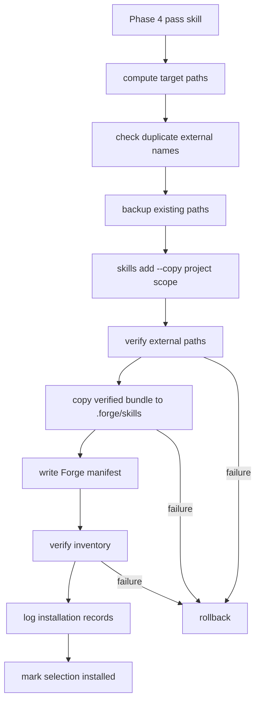

# Phase 5 - Project Installation Workspace Layout

> [!warning] Scope Boundary
> Phase 5 installs already-audited skills into the generated project workspace and verifies the files. It must not discover new skills, score candidates, make audit decisions, inject prompts, or decide pipeline timing.

> [!abstract] Outcome
> At the end of Phase 5, Forge can take Phase 4 `pass` skills, install copied project-scope skill files into deterministic workspace paths, verify every expected path, roll back partial installs, record installation attempts, and expose a normalized installed-skill inventory for Phase 6.

## Research Questions

- Which project paths does `npx skills add` write for Codex, Claude Code, and shared agent compatibility?
- Does non-interactive installation copy or symlink by default?
- What does `skills-lock.json` contain after project installation?
- Can `skills list --json` be trusted as the only verification source?
- Where should Forge store its own canonical skill inventory?
- How should install rollback work when the CLI partially writes files?
- How does Forge's isolated task workspace behavior affect skill placement?
- How should duplicate skill names from different sources be handled?

## Researched Facts

### Evidence: Current Branch And Dirty State

Command:

```bash
git status --short --branch
```

Observed:

```text
## feature/skills-sh-context
?? .env
?? docs/plans/2026-06-06-skills-sh-context.md
?? "docs/plans/Skills.sh Context System Phases.base"
?? docs/plans/skills-sh-context-phases/
?? pyproject.toml
?? tests/test_cli.py
```

Plan impact:

- Work is on `feature/skills-sh-context`.
- `.env`, `pyproject.toml`, and `tests/test_cli.py` are unrelated untracked files and must not be touched by Phase 5.
- Phase 5 remains documentation-only until implementation starts.

### Evidence: Master Phase Boundary

Master plan Phase 5 subphases:

- 5.1 Install target research
  - 5.1.1 Forge-native `.forge/skills`
  - 5.1.2 Shared `.agents/skills`
  - 5.1.3 External-agent compatibility paths
- 5.2 Install execution
  - 5.2.1 Project-scope install
  - 5.2.2 Copy-vs-symlink behavior
  - 5.2.3 Verification after install
  - 5.2.4 Cleanup and rollback on failure
- 5.3 Installed inventory
  - 5.3.1 Read installed skill frontmatter
  - 5.3.2 Deduplicate names
  - 5.3.3 Persist selected inventory

Plan impact:

- This phase owns physical workspace layout and install lifecycle.
- Prompt injection remains Phase 6.
- Pipeline timing remains Phase 7.

### Evidence: Prior Phase Dependencies

Phase 1 planned:

```typescript
export type SkillInstallTarget = "forge" | "agents" | "claude";

export interface SkillInstallRecord {
  selectionId: string;
  target: SkillInstallTarget;
  installPath: string;
  status: "installed" | "failed";
  error?: string;
}
```

Phase 1 also planned:

- `SkillConfig.installTargets`, defaulting to `["forge", "agents"]`
- `skill_installations`
- `logSkillInstallation()`

Phase 2 planned:

```typescript
await run([
  "add",
  source,
  "--skill",
  skillName,
  "--copy",
  "--yes",
  "--agent",
  ...agents,
], workspace);
```

Phase 4 planned:

- only Phase 4 `pass` verdicts may continue to install or prompt injection
- support files must be audited before use
- hard-block findings are not overrideable in v1

Plan impact:

- Phase 5 consumes Phase 4 pass candidates.
- Phase 5 logs through Phase 1 installation records.
- Phase 5 uses Phase 2 `SkillsCli.install()` and `SkillsCli.listInstalled()`.
- Phase 5 may run a post-install Phase 4 audit against installed files as verification, but must not create new audit rules.

### Evidence: Official Skills CLI Docs

Sources:

- [vercel-labs/skills README](https://github.com/vercel-labs/skills/blob/main/README.md)
- [Vercel Agent Skills docs](https://vercel.com/docs/agent-resources/skills)
- [Vercel Agent Skills knowledge base](https://vercel.com/kb/guide/agent-skills-creating-installing-and-sharing-reusable-agent-context)

Researched facts:

- `npx skills add <owner/repo>` installs skills.
- `--skill <name>` installs a specific skill from a multi-skill repo.
- `--agent <agent>` targets specific agents.
- `--copy` copies files instead of symlinking to agent directories.
- `--yes` skips prompts.
- Project scope is the default and installs into project-local agent paths.
- Global scope uses `-g`, but global installs are out of scope for Forge v1.
- The README documents Codex project path as `.agents/skills/` and global path as `~/.codex/skills/`.
- The README documents project scope as committed with the project and shared with the team.
- The Vercel knowledge base says skills should be treated like code, reviewed before install, and handled carefully when scripts exist.

Plan impact:

- Phase 5 must always run project-scoped installs, never `-g`.
- Phase 5 must always pass `--copy`.
- Phase 5 must verify actual filesystem output, not only CLI success.

### Evidence: OpenCode Project Skill Layout

Source:

- [OpenCode Agent Skills docs](https://opencode.ubitools.com/skills/)

Researched facts:

- OpenCode supports project-local skill definitions.
- OpenCode searches `.opencode/skill/<name>/SKILL.md`.
- OpenCode also loads Claude-compatible project skills from `.claude/skills/<name>/SKILL.md`.
- OpenCode validates `name` and `description` frontmatter.
- OpenCode lists available skills by name and description and loads full skill content on demand.

Plan impact:

- `.claude/skills` is a useful compatibility target for Claude-compatible agents.
- `.agents/skills` remains the skills CLI's shared path for Codex and several other agents.
- Forge-native inventory should not assume every external agent reads the same path.

### Evidence: Real Project Install With `--copy`

Temp workspace:

```text
/private/tmp/forge-skills-phase5-copy-fz8Ekl
```

Command:

```bash
env DISABLE_TELEMETRY=1 NO_COLOR=1 npx --yes skills add vercel-labs/agent-skills --skill deploy-to-vercel --agent codex --copy --yes
```

Observed output summary after ANSI stripping:

```text
codex Agent detected - installing non-interactively
Source: https://github.com/vercel-labs/agent-skills.git
Found 9 skills
Selected 1 skill: deploy-to-vercel
Installation Summary:
  ./.agents/skills/deploy-to-vercel
    copy -> Codex
Installed 1 skill:
  deploy-to-vercel (copied)
    -> ./.agents/skills/deploy-to-vercel
Done! Review skills before use; they run with full agent permissions.
```

Files:

```text
/private/tmp/forge-skills-phase5-copy-fz8Ekl/.agents/skills/deploy-to-vercel/SKILL.md
/private/tmp/forge-skills-phase5-copy-fz8Ekl/.agents/skills/deploy-to-vercel/resources/deploy-codex.sh
/private/tmp/forge-skills-phase5-copy-fz8Ekl/.agents/skills/deploy-to-vercel/resources/deploy.sh
/private/tmp/forge-skills-phase5-copy-fz8Ekl/skills-lock.json
```

Directory listing:

```text
.agents/skills/deploy-to-vercel/
  SKILL.md
  resources/
    deploy-codex.sh
    deploy.sh
```

Plan impact:

- A copied install preserves support files.
- Forge should verify support files exist when the audited bundle included them.
- `skills-lock.json` is written at the project root.

### Evidence: Real Non-Interactive Install Without `--copy`

Temp workspace:

```text
/private/tmp/forge-skills-phase5-link-7k4HwZ
```

Command:

```bash
env DISABLE_TELEMETRY=1 NO_COLOR=1 npx --yes skills add vercel-labs/agent-skills --skill deploy-to-vercel --agent codex --yes
```

Observed output summary after ANSI stripping:

```text
Installation Summary:
  ./.agents/skills/deploy-to-vercel
    copy -> Codex
Installed 1 skill:
  deploy-to-vercel (copied)
    -> ./.agents/skills/deploy-to-vercel
```

Observed files and lock file were the same as explicit `--copy`.

Plan impact:

- Current CLI behavior copied in this non-interactive scenario, but Phase 5 should still pass `--copy` explicitly.
- Phase 5 should also reject symlinks after install because CLI behavior may change.

### Evidence: Project `skills-lock.json`

Observed:

```json
{
  "version": 1,
  "skills": {
    "deploy-to-vercel": {
      "source": "vercel-labs/agent-skills",
      "sourceType": "github",
      "skillPath": "skills/deploy-to-vercel/SKILL.md",
      "computedHash": "03e0eaaa9bf13ba1e7ffa387f5893de6f324c0868c627001f179395a8feaa7c9"
    }
  }
}
```

Plan impact:

- Lock entries are keyed by skill name, not source plus skill name.
- Lock entries include source, source type, skill path, and computed hash.
- `skills-lock.json` is useful for verification and update diagnostics, but Forge should keep canonical lifecycle state in SQLite.
- Duplicate skill names from different packages can conflict in lock and external agent directories.

### Evidence: `skills list --json`

Command:

```bash
env DISABLE_TELEMETRY=1 NO_COLOR=1 npx --yes skills list --json
```

Observed in Codex-only install:

```json
[
  {
    "name": "deploy-to-vercel",
    "path": "/private/tmp/forge-skills-phase5-copy-fz8Ekl/.agents/skills/deploy-to-vercel",
    "scope": "project",
    "agents": [
      "Antigravity",
      "Codex",
      "Cursor",
      "Gemini CLI",
      "OpenCode",
      "Zed"
    ]
  }
]
```

Agent-filtered commands:

```bash
skills list --json --agent codex
skills list --json --agent opencode
skills list --json --agent claude-code
```

Observed:

```json
[
  {
    "name": "deploy-to-vercel",
    "path": ".../.agents/skills/deploy-to-vercel",
    "scope": "project",
    "agents": ["Codex"]
  }
]
```

```json
[
  {
    "name": "deploy-to-vercel",
    "path": ".../.agents/skills/deploy-to-vercel",
    "scope": "project",
    "agents": ["OpenCode"]
  }
]
```

```json
[
  {
    "name": "deploy-to-vercel",
    "path": ".../.agents/skills/deploy-to-vercel",
    "scope": "project",
    "agents": []
  }
]
```

Plan impact:

- `.agents/skills` is a shared compatibility path.
- `skills list --json` is useful, but it does not prove every agent-specific compatibility directory exists.
- Phase 5 must verify expected filesystem paths directly.

### Evidence: Multi-Agent Project Install

Temp workspace:

```text
/private/tmp/forge-skills-phase5-multi-Ejt8LU
```

Command:

```bash
env DISABLE_TELEMETRY=1 NO_COLOR=1 npx --yes skills add vercel-labs/agent-skills --skill deploy-to-vercel --agent codex --agent claude-code --copy --yes
```

Observed output summary after ANSI stripping:

```text
Installation Summary:
  ./.agents/skills/deploy-to-vercel
    copy -> Codex, Claude Code
Installed 1 skill:
  deploy-to-vercel (copied)
    -> ./.agents/skills/deploy-to-vercel
    -> ./.claude/skills/deploy-to-vercel
```

Observed files:

```text
.agents/skills/deploy-to-vercel/SKILL.md
.agents/skills/deploy-to-vercel/resources/deploy-codex.sh
.agents/skills/deploy-to-vercel/resources/deploy.sh
.claude/skills/deploy-to-vercel/SKILL.md
.claude/skills/deploy-to-vercel/resources/deploy-codex.sh
.claude/skills/deploy-to-vercel/resources/deploy.sh
skills-lock.json
```

Path checks:

```text
No symlinks were found under .agents or .claude.
diff -qr .agents/skills/deploy-to-vercel .claude/skills/deploy-to-vercel exited 0.
Both directories were 36 KB.
```

Observed `skills list --json`:

```json
[
  {
    "name": "deploy-to-vercel",
    "path": "/private/tmp/forge-skills-phase5-multi-Ejt8LU/.agents/skills/deploy-to-vercel",
    "scope": "project",
    "agents": [
      "Antigravity",
      "Claude Code",
      "Codex",
      "Cursor",
      "Gemini CLI",
      "OpenCode",
      "Zed"
    ]
  }
]
```

Plan impact:

- Installing for `codex` plus `claude-code` writes both `.agents/skills/<name>` and `.claude/skills/<name>`.
- `skills list --json` still reports the canonical `.agents` path.
- Verification must check `.claude/skills/<name>/SKILL.md` separately when target `claude` is requested.

### Evidence: Forge Workspace Lifecycle

Files inspected:

- `src/session.ts`
- `src/overseer.ts`
- `src/externalAgents.ts`

Session creation:

```typescript
const sessionDir = path.join(sessionsDir, id);
fs.mkdirSync(path.join(sessionDir, "logs"), { recursive: true });
const resolvedWorkspace = workspace ?? path.join(sessionDir, "workspace");
fs.mkdirSync(resolvedWorkspace, { recursive: true });
```

External-agent coding isolation:

```typescript
const useIsolation =
  externalAgentFor(this.session.router.modelFor(ModelTier.REASONING)) !== undefined;
const tasksDir = path.join(this.session.workspace, "tasks");
if (useIsolation) {
  if (fs.existsSync(tasksDir)) fs.rmSync(tasksDir, { recursive: true, force: true });
  try {
    await Promise.all(pending.map(t => {
      const taskWorkspace = path.join(tasksDir, String(t["id"]));
      fs.mkdirSync(taskWorkspace, { recursive: true });
      return this.codeTask(t, taskWorkspace);
    }));
    this.mergeTaskDirs(tasksDir, this.session.workspace);
  } finally {
    fs.rmSync(tasksDir, { recursive: true, force: true });
  }
}
```

Merge behavior:

```typescript
private copyDir(src: string, dst: string): void {
  for (const entry of fs.readdirSync(src, { withFileTypes: true })) {
    if (entry.name.startsWith(".")) continue;
    // ...
  }
}
```

External agent ids:

```typescript
export type ExternalAgentId = "codex" | "claude-code";
```

Plan impact:

- Root workspace install belongs at `session.workspace`.
- External-agent task workspaces may not automatically see root project skills.
- Dot directories created inside isolated task workspaces are intentionally not merged back.
- Phase 5 should provide idempotent install helpers for any workspace path; Phase 7 decides whether to call them for root workspace, task workspace, or both.

## Installation Policy

### Core Policy

- Install only candidates whose latest Phase 4 audit verdict is `pass`.
- Install project scope only.
- Never pass `-g` or `--global`.
- Always pass `--copy`.
- Never execute installed support scripts during installation verification.
- Treat successful CLI exit as necessary but not sufficient.
- Verify actual files and frontmatter after installation.
- Roll back partial writes if verification fails.
- Store Forge's canonical installed inventory in `.forge/skills` and SQLite, not only `skills-lock.json`.

### Target Semantics

| Target | Path | Created By | Purpose |
|---|---|---|---|
| `forge` | `.forge/skills/<source-key>/` | Forge copy step | Forge-native inventory and Phase 6 context provider |
| `agents` | `.agents/skills/<skill-name>/` | `skills add --agent codex --copy` | Shared project skill path for Codex, OpenCode, Gemini CLI, Cursor, Zed, and compatible agents |
| `claude` | `.claude/skills/<skill-name>/` | `skills add --agent claude-code --copy` | Claude Code and Claude-compatible project skill path |

Default config remains:

```typescript
installTargets: ["forge", "agents"]
```

Implication:

- Forge-native reading works even if no external agent is active.
- Codex/OpenCode-compatible project discovery works by default.
- Claude Code compatibility is opt-in through `installTargets: ["forge", "agents", "claude"]` or future setup UX.

### Directory Naming

External agent paths must use the skill name:

```text
.agents/skills/<skillName>/
.claude/skills/<skillName>/
```

Forge-native paths should avoid collisions:

```text
.forge/skills/<sourceOwner>__<sourceRepo>__<skillName>/
```

Example:

```text
.forge/skills/vercel-labs__agent-skills__deploy-to-vercel/
```

Rationale:

- `skills-lock.json` and external agent paths are keyed by skill name.
- Forge may discover two different packages with the same skill name.
- Phase 6 can expose original skill name and source from the manifest, so the internal directory can be collision-safe.

### Duplicate Policy

| Duplicate Case | Behavior |
|---|---|
| Same `packageRef@skillName` already installed | Treat as idempotent success after verification |
| Same `skillName`, same `packageRef`, new hash | Reinstall with backup and verify |
| Same `skillName`, different `packageRef` | Install both into `.forge/skills`; skip external agent install for the lower-ranked conflict |
| Existing user skill at external path | Do not overwrite unless `skills-lock.json` proves Forge installed the same source |

Phase 5 must preserve user-authored skills.

## File Map

| File | Action | Responsibility |
|---|---|---|
| `src/skills/install.ts` | Create | Install orchestration, target mapping, verification, rollback |
| `src/skills/inventory.ts` | Create | Installed skill manifest parsing and normalized inventory |
| `src/skills/paths.ts` | Create | Workspace-safe path helpers and naming utilities |
| `tests/skillsInstall.test.ts` | Create | Installer orchestration tests with fake CLI and temp workspaces |
| `tests/skillsInventory.test.ts` | Create | Inventory, frontmatter, and duplicate tests |
| `tests/skillsPaths.test.ts` | Create | Path resolution, target mapping, and collision-safe key tests |
| `tests/fixtures/skills-install/deploy-to-vercel/` | Create | Small installed skill fixture with support files |
| `docs/plans/skills-sh-context-phases/Phase 5 - Project Installation Workspace Layout.md` | Maintain | This implementation-ready plan |

## Public Interfaces

### Install Types

```typescript
import type {
  SkillCandidate,
  SkillConfig,
  SkillInstallRecord,
  SkillInstallTarget,
} from "./types.js";

export interface AuditedSkillForInstall {
  selectionId: string;
  candidateId: string;
  candidate: SkillCandidate;
  auditVerdict: "pass";
  auditReasons: string[];
}

export interface SkillInstallPathSet {
  forge?: string;
  agents?: string;
  claude?: string;
  lockFile: string;
}

export interface SkillInstallVerification {
  target: SkillInstallTarget;
  path: string;
  ok: boolean;
  reason?: string;
  name?: string;
  description?: string;
  fileCount?: number;
  byteCount?: number;
  lockHash?: string;
}

export interface InstalledSkillManifest {
  schemaVersion: 1;
  installedAt: string;
  packageRef: string;
  skillName: string;
  sourceOwner: string;
  sourceRepo: string;
  candidateId: string;
  selectionId: string;
  auditVerdict: "pass";
  installTargets: SkillInstallTarget[];
  externalPaths: Record<string, string>;
  lock?: {
    source?: string;
    sourceType?: string;
    skillPath?: string;
    computedHash?: string;
  };
}

export interface InstallAuditedSkillInput {
  sessionId: string;
  workspace: string;
  config: SkillConfig;
  skill: AuditedSkillForInstall;
}

export interface InstallAuditedSkillResult {
  candidateKey: string;
  status: "installed" | "failed" | "skipped";
  installPaths: SkillInstallPathSet;
  verifications: SkillInstallVerification[];
  error?: string;
}
```

### Install Client Interface

Phase 5 should depend on a narrow interface instead of the concrete Phase 2 class.

```typescript
export interface SkillInstallClient {
  install(request: {
    source: string;
    skillName: string;
    workspace: string;
    agents: string[];
    copy: true;
  }): Promise<{
    source: string;
    skillName: string;
    agents: string[];
    rawOutput: string;
    installed: Array<{
      name: string;
      path: string;
      status: "installed" | "failed";
      method?: "copy" | "symlink";
    }>;
  }>;

  listInstalled(workspace: string, agent?: string): Promise<Array<{
    name: string;
    path: string;
    scope: "project" | "global";
    agents: string[];
  }>>;
}
```

### Install DB Interface

```typescript
export interface SkillInstallDb {
  logSkillInstallation(sessionId: string, install: SkillInstallRecord): string;
  selectSkill(sessionId: string, selection: {
    candidateId: string;
    status: "selected" | "skipped" | "installed" | "failed";
    phase: string;
    taskId?: string;
    rationale: string;
  }): string;
}
```

### Installer API

```typescript
export async function installAuditedSkill(
  input: InstallAuditedSkillInput,
  client: SkillInstallClient,
  db: SkillInstallDb,
): Promise<InstallAuditedSkillResult>;

export async function installAuditedSkills(
  input: {
    sessionId: string;
    workspace: string;
    config: SkillConfig;
    skills: AuditedSkillForInstall[];
  },
  client: SkillInstallClient,
  db: SkillInstallDb,
): Promise<InstallAuditedSkillResult[]>;
```

## Path Design

### Workspace Guard

```typescript
export function resolveInWorkspace(workspace: string, relativePath: string): string {
  const root = path.resolve(workspace);
  const resolved = path.resolve(root, relativePath);
  if (resolved !== root && !resolved.startsWith(root + path.sep)) {
    throw new Error(`Path escapes workspace: ${relativePath}`);
  }
  return resolved;
}
```

### Skill Key

```typescript
export function skillInstallKey(candidate: SkillCandidate): string {
  return `${candidate.packageRef}@${candidate.skillName}`.toLowerCase();
}
```

### Safe Directory Name

```typescript
export function safeSkillDirPart(value: string): string {
  return value
    .toLowerCase()
    .replace(/[^a-z0-9_-]+/g, "-")
    .replace(/-+/g, "-")
    .replace(/^-|-$/g, "")
    .slice(0, 80) || "skill";
}

export function forgeSkillDirName(candidate: SkillCandidate): string {
  return [
    safeSkillDirPart(candidate.sourceOwner),
    safeSkillDirPart(candidate.sourceRepo),
    safeSkillDirPart(candidate.skillName),
  ].join("__");
}
```

### Target Paths

```typescript
export function installPaths(workspace: string, candidate: SkillCandidate): SkillInstallPathSet {
  const skillName = safeSkillDirPart(candidate.skillName);
  return {
    forge: resolveInWorkspace(workspace, path.join(".forge", "skills", forgeSkillDirName(candidate))),
    agents: resolveInWorkspace(workspace, path.join(".agents", "skills", skillName)),
    claude: resolveInWorkspace(workspace, path.join(".claude", "skills", skillName)),
    lockFile: resolveInWorkspace(workspace, "skills-lock.json"),
  };
}
```

## Target Mapping

### Config Targets To Skills CLI Agents

```typescript
export function cliAgentsForTargets(targets: SkillInstallTarget[]): string[] {
  const agents = new Set<string>();

  if (targets.includes("agents")) {
    // The skills CLI maps Codex project installs to .agents/skills,
    // which is also reported for OpenCode, Cursor, Gemini CLI, and others.
    agents.add("codex");
  }

  if (targets.includes("claude")) {
    agents.add("claude-code");
  }

  return [...agents];
}
```

Notes:

- `forge` does not map to a skills CLI agent.
- `forge` is populated by copying from a verified installed bundle.
- If config only contains `forge`, Phase 5 can avoid `skills add` and materialize from the Phase 4 audited bundle only if that bundle is available in the same run. For resume safety, v1 should still prefer `skills add` plus post-install verification.

## Installation Flow

### High-Level Flow



### Single Skill Install Sketch

```typescript
export async function installAuditedSkill(
  input: InstallAuditedSkillInput,
  client: SkillInstallClient,
  db: SkillInstallDb,
): Promise<InstallAuditedSkillResult> {
  const { sessionId, workspace, config, skill } = input;
  const candidate = skill.candidate;
  const paths = installPaths(workspace, candidate);
  const targets = config.installTargets;
  const agents = cliAgentsForTargets(targets);
  const candidateKey = skillInstallKey(candidate);

  if (skill.auditVerdict !== "pass") {
    return {
      candidateKey,
      status: "skipped",
      installPaths: paths,
      verifications: [],
      error: "skill was not audit-approved",
    };
  }

  return withInstallRollback(workspace, pathsForRollback(paths, targets), async () => {
    if (agents.length > 0) {
      await client.install({
        source: candidate.packageRef,
        skillName: candidate.skillName,
        workspace,
        agents,
        copy: true,
      });
    }

    const lock = readSkillsLock(paths.lockFile);
    const externalChecks = verifyExternalTargets(paths, targets, candidate, lock);
    const failedExternal = externalChecks.find((check) => !check.ok);
    if (failedExternal) throw new Error(failedExternal.reason ?? `failed verifying ${failedExternal.path}`);

    if (targets.includes("forge")) {
      const sourceForForge = preferredSourcePath(paths, targets);
      copySkillDirectory(sourceForForge, paths.forge!);
      writeForgeManifest(paths.forge!, manifestFor(input, paths, lock));
    }

    const verifications = [
      ...externalChecks,
      ...(targets.includes("forge") ? [verifyForgeTarget(paths.forge!, candidate)] : []),
    ];

    for (const target of targets) {
      const installPath = pathForTarget(paths, target);
      db.logSkillInstallation(sessionId, {
        selectionId: skill.selectionId,
        target,
        installPath: path.relative(workspace, installPath),
        status: "installed",
      });
    }

    db.selectSkill(sessionId, {
      candidateId: skill.candidateId,
      status: "installed",
      phase: "SKILL_INSTALL",
      rationale: `installed ${candidateKey} to ${targets.join(", ")}`,
    });

    return {
      candidateKey,
      status: "installed" as const,
      installPaths: paths,
      verifications,
    };
  }).catch((error: unknown) => {
    const message = error instanceof Error ? error.message : String(error);
    for (const target of targets) {
      db.logSkillInstallation(sessionId, {
        selectionId: skill.selectionId,
        target,
        installPath: path.relative(workspace, pathForTarget(paths, target)),
        status: "failed",
        error: message,
      });
    }
    db.selectSkill(sessionId, {
      candidateId: skill.candidateId,
      status: "failed",
      phase: "SKILL_INSTALL",
      rationale: `install failed: ${message}`,
    });
    return {
      candidateKey,
      status: "failed" as const,
      installPaths: paths,
      verifications: [],
      error: message,
    };
  });
}
```

### Batch Install Sketch

```typescript
export async function installAuditedSkills(
  input: {
    sessionId: string;
    workspace: string;
    config: SkillConfig;
    skills: AuditedSkillForInstall[];
  },
  client: SkillInstallClient,
  db: SkillInstallDb,
): Promise<InstallAuditedSkillResult[]> {
  const results: InstallAuditedSkillResult[] = [];
  const plannedNames = new Map<string, string>();

  for (const skill of input.skills) {
    const nameKey = skill.candidate.skillName.toLowerCase();
    const candidateKey = skillInstallKey(skill.candidate);
    const existing = plannedNames.get(nameKey);
    if (existing && existing !== candidateKey) {
      results.push({
        candidateKey,
        status: "skipped",
        installPaths: installPaths(input.workspace, skill.candidate),
        verifications: [],
        error: `external skill name conflict with ${existing}`,
      });
      continue;
    }
    plannedNames.set(nameKey, candidateKey);
    results.push(await installAuditedSkill(inputForSkill(input, skill), client, db));
  }

  return results;
}
```

## Rollback Design

### Rollback Scope

Before installing one skill, back up:

- `.forge/skills/<source-key>`
- `.agents/skills/<skill-name>`
- `.claude/skills/<skill-name>`
- `skills-lock.json`

Only back up paths relevant to configured targets.

### Rollback Helper

```typescript
interface InstallBackupEntry {
  targetPath: string;
  backupPath?: string;
  existed: boolean;
}

export async function withInstallRollback<T>(
  workspace: string,
  targetPaths: string[],
  action: () => Promise<T>,
): Promise<T> {
  const backupRoot = fs.mkdtempSync(path.join(os.tmpdir(), "forge-skill-install-"));
  const backups = createBackups(targetPaths, backupRoot);

  try {
    return await action();
  } catch (error) {
    restoreBackups(backups);
    throw error;
  } finally {
    fs.rmSync(backupRoot, { recursive: true, force: true });
  }
}
```

Backup creation:

```typescript
function createBackups(targetPaths: string[], backupRoot: string): InstallBackupEntry[] {
  return targetPaths.map((targetPath, index) => {
    if (!fs.existsSync(targetPath)) return { targetPath, existed: false };

    const backupPath = path.join(backupRoot, String(index));
    const stat = fs.lstatSync(targetPath);
    if (stat.isDirectory()) {
      fs.cpSync(targetPath, backupPath, { recursive: true, dereference: false });
    } else {
      fs.mkdirSync(path.dirname(backupPath), { recursive: true });
      fs.copyFileSync(targetPath, backupPath);
    }
    return { targetPath, backupPath, existed: true };
  });
}
```

Backup restore:

```typescript
function restoreBackups(backups: InstallBackupEntry[]): void {
  for (const backup of backups) {
    fs.rmSync(backup.targetPath, { recursive: true, force: true });
    if (!backup.existed || !backup.backupPath) continue;

    const stat = fs.lstatSync(backup.backupPath);
    fs.mkdirSync(path.dirname(backup.targetPath), { recursive: true });
    if (stat.isDirectory()) {
      fs.cpSync(backup.backupPath, backup.targetPath, { recursive: true, dereference: false });
    } else {
      fs.copyFileSync(backup.backupPath, backup.targetPath);
    }
  }
}
```

Safety notes:

- All target paths must be resolved through `resolveInWorkspace()`.
- Never roll back arbitrary paths returned by CLI output.
- Do not run `rm` shell commands; use Node filesystem APIs.
- Rollback should restore the pre-install `skills-lock.json`.

## Verification Design

### External Target Verification

```typescript
export function verifyExternalTargets(
  paths: SkillInstallPathSet,
  targets: SkillInstallTarget[],
  candidate: SkillCandidate,
  lock: SkillsLock | undefined,
): SkillInstallVerification[] {
  const checks: SkillInstallVerification[] = [];

  if (targets.includes("agents")) {
    checks.push(verifyInstalledSkillDir("agents", paths.agents!, candidate, lock));
  }

  if (targets.includes("claude")) {
    checks.push(verifyInstalledSkillDir("claude", paths.claude!, candidate, lock));
  }

  return checks;
}
```

### Installed Directory Verification

```typescript
export function verifyInstalledSkillDir(
  target: SkillInstallTarget,
  dir: string,
  candidate: SkillCandidate,
  lock: SkillsLock | undefined,
): SkillInstallVerification {
  const skillFile = path.join(dir, "SKILL.md");
  if (!fs.existsSync(skillFile)) {
    return { target, path: dir, ok: false, reason: "missing SKILL.md" };
  }

  const symlink = containsSymlink(dir);
  if (symlink) {
    return { target, path: dir, ok: false, reason: `symlink found: ${symlink}` };
  }

  const markdown = fs.readFileSync(skillFile, "utf8");
  const { frontmatter } = parseSkillMarkdown(markdown);
  if (frontmatter.name && frontmatter.name !== candidate.skillName) {
    return {
      target,
      path: dir,
      ok: false,
      reason: `frontmatter name ${frontmatter.name} did not match ${candidate.skillName}`,
    };
  }

  const counts = countFilesAndBytes(dir);
  const lockEntry = lock?.skills?.[candidate.skillName];
  return {
    target,
    path: dir,
    ok: true,
    name: frontmatter.name,
    description: frontmatter.description,
    fileCount: counts.files,
    byteCount: counts.bytes,
    lockHash: lockEntry?.computedHash,
  };
}
```

### Symlink Detection

```typescript
export function containsSymlink(root: string): string | undefined {
  for (const entry of walk(root)) {
    if (fs.lstatSync(entry).isSymbolicLink()) {
      return path.relative(root, entry);
    }
  }
  return undefined;
}
```

### Lock File Parsing

```typescript
export interface SkillsLock {
  version: number;
  skills: Record<string, {
    source?: string;
    sourceType?: string;
    skillPath?: string;
    computedHash?: string;
  }>;
}

export function readSkillsLock(lockFile: string): SkillsLock | undefined {
  if (!fs.existsSync(lockFile)) return undefined;
  try {
    const parsed = JSON.parse(fs.readFileSync(lockFile, "utf8"));
    if (!parsed || typeof parsed !== "object") return undefined;
    if (typeof parsed.version !== "number") return undefined;
    if (!parsed.skills || typeof parsed.skills !== "object") return undefined;
    return parsed as SkillsLock;
  } catch {
    return undefined;
  }
}
```

### Lock Verification

```typescript
export function verifyLockEntry(lock: SkillsLock | undefined, candidate: SkillCandidate): string | undefined {
  if (!lock) return "missing skills-lock.json";
  const entry = lock.skills[candidate.skillName];
  if (!entry) return `missing lock entry for ${candidate.skillName}`;
  if (entry.source !== candidate.packageRef) {
    return `lock source ${entry.source ?? "(missing)"} did not match ${candidate.packageRef}`;
  }
  if (!entry.computedHash) return "missing lock computedHash";
  return undefined;
}
```

### Post-Install Audit Verification

Phase 5 should reuse Phase 4 code after install:

```typescript
export function verifyInstalledAuditPass(
  dir: string,
  candidate: SkillCandidate,
  config: SkillConfig,
): string | undefined {
  const bundle = loadSkillBundle({
    source: candidate.packageRef,
    skillName: candidate.skillName,
    skillMarkdown: fs.readFileSync(path.join(dir, "SKILL.md"), "utf8"),
    supportDir: dir,
  });
  const audit = auditSkillBundle({ candidate, bundle, config, phase: "SKILL_INSTALL" });
  return audit.verdict === "pass" ? undefined : `post-install audit ${audit.verdict}: ${audit.summary}`;
}
```

This does not make a new security decision. It proves the installed files still satisfy the Phase 4 policy.

## Forge-Native Manifest

### Manifest Path

```text
.forge/skills/<source-key>/forge-skill.json
```

### Manifest Shape

```json
{
  "schemaVersion": 1,
  "installedAt": "2026-06-07T00:00:00.000Z",
  "packageRef": "vercel-labs/agent-skills",
  "skillName": "deploy-to-vercel",
  "sourceOwner": "vercel-labs",
  "sourceRepo": "agent-skills",
  "candidateId": "c1",
  "selectionId": "s1",
  "auditVerdict": "pass",
  "installTargets": ["forge", "agents"],
  "externalPaths": {
    "agents": ".agents/skills/deploy-to-vercel"
  },
  "lock": {
    "source": "vercel-labs/agent-skills",
    "sourceType": "github",
    "skillPath": "skills/deploy-to-vercel/SKILL.md",
    "computedHash": "03e0eaaa9bf13ba1e7ffa387f5893de6f324c0868c627001f179395a8feaa7c9"
  }
}
```

### Manifest Writer

```typescript
export function writeForgeManifest(dir: string, manifest: InstalledSkillManifest): void {
  fs.mkdirSync(dir, { recursive: true });
  fs.writeFileSync(
    path.join(dir, "forge-skill.json"),
    JSON.stringify(manifest, null, 2) + "\n",
    "utf8",
  );
}
```

## Inventory Design

### Inventory Types

```typescript
export interface InstalledSkillInventoryEntry {
  packageRef: string;
  skillName: string;
  displayName: string;
  description: string;
  forgePath?: string;
  agentsPath?: string;
  claudePath?: string;
  sourceKey: string;
  installedAt?: string;
  lockHash?: string;
}
```

### Inventory API

```typescript
export function listForgeInstalledSkills(workspace: string): InstalledSkillInventoryEntry[];

export function findInstalledSkill(
  workspace: string,
  packageRef: string,
  skillName: string,
): InstalledSkillInventoryEntry | undefined;
```

### Inventory Reader Sketch

```typescript
export function listForgeInstalledSkills(workspace: string): InstalledSkillInventoryEntry[] {
  const root = resolveInWorkspace(workspace, path.join(".forge", "skills"));
  if (!fs.existsSync(root)) return [];

  const entries: InstalledSkillInventoryEntry[] = [];
  for (const dirName of fs.readdirSync(root)) {
    const dir = path.join(root, dirName);
    if (!fs.statSync(dir).isDirectory()) continue;

    const manifest = readForgeManifest(path.join(dir, "forge-skill.json"));
    const skillFile = path.join(dir, "SKILL.md");
    if (!manifest || !fs.existsSync(skillFile)) continue;

    const parsed = parseSkillMarkdown(fs.readFileSync(skillFile, "utf8"));
    entries.push({
      packageRef: manifest.packageRef,
      skillName: manifest.skillName,
      displayName: parsed.frontmatter.name ?? manifest.skillName,
      description: parsed.frontmatter.description ?? "",
      forgePath: path.relative(workspace, dir),
      agentsPath: manifest.externalPaths["agents"],
      claudePath: manifest.externalPaths["claude"],
      sourceKey: dirName,
      installedAt: manifest.installedAt,
      lockHash: manifest.lock?.computedHash,
    });
  }

  return entries.sort((a, b) => a.skillName.localeCompare(b.skillName));
}
```

## Isolated Task Workspace Policy

### Problem

When Forge uses external agents for coding, it creates per-task workspaces:

```text
<session-workspace>/tasks/<task-id>/
```

Those task workspaces are passed to the external agent. Dot directories from task workspaces are not merged back into the root workspace.

### Phase 5 Utility

Phase 5 should provide a workspace-agnostic install API:

```typescript
export async function ensureSkillsInstalledForWorkspace(
  workspace: string,
  skills: AuditedSkillForInstall[],
  config: SkillConfig,
  client: SkillInstallClient,
  db: SkillInstallDb,
  sessionId: string,
): Promise<InstallAuditedSkillResult[]> {
  return installAuditedSkills({ sessionId, workspace, config, skills }, client, db);
}
```

### Phase 7 Responsibility

Phase 7 decides when to call it:

- root workspace before Forge-native prompt context
- external task workspace before a Codex task
- external task workspace before a Claude Code task, if `claude` target is enabled
- verification or deploy workspace when late-stage skills are selected

### Merge Safety

Skills installed into isolated task workspaces should be disposable:

- They live under dot directories.
- `mergeTaskDirs()` skips dot directories.
- They are removed when the task workspace is deleted.

Plan impact:

- Phase 5 must not special-case task workspaces.
- Phase 5 must only require that the supplied workspace path is writable and workspace-safe.

## Implementation Tasks

### Task 5.1 - Add Path Helpers

Files:

- Create `src/skills/paths.ts`
- Create `tests/skillsPaths.test.ts`

Tests to write first:

```typescript
test("resolveInWorkspace rejects path escapes", () => {
  const workspace = fs.mkdtempSync(path.join(os.tmpdir(), "forge-skill-paths-"));
  expect(() => resolveInWorkspace(workspace, "../outside")).toThrow("Path escapes workspace");
});

test("installPaths maps candidate to forge agents and claude paths", () => {
  const candidate = makeCandidate({
    packageRef: "vercel-labs/agent-skills",
    sourceOwner: "vercel-labs",
    sourceRepo: "agent-skills",
    skillName: "deploy-to-vercel",
  });
  const paths = installPaths("/tmp/ws", candidate);
  expect(paths.forge).toBe("/tmp/ws/.forge/skills/vercel-labs__agent-skills__deploy-to-vercel");
  expect(paths.agents).toBe("/tmp/ws/.agents/skills/deploy-to-vercel");
  expect(paths.claude).toBe("/tmp/ws/.claude/skills/deploy-to-vercel");
});

test("cliAgentsForTargets maps agents and claude only", () => {
  expect(cliAgentsForTargets(["forge", "agents"])).toEqual(["codex"]);
  expect(cliAgentsForTargets(["forge", "agents", "claude"])).toEqual(["codex", "claude-code"]);
});
```

Implementation steps:

- [ ] Add `resolveInWorkspace()`.
- [ ] Add `safeSkillDirPart()`.
- [ ] Add `forgeSkillDirName()`.
- [ ] Add `skillInstallKey()`.
- [ ] Add `installPaths()`.
- [ ] Add `cliAgentsForTargets()`.

### Task 5.2 - Add Inventory Reader

Files:

- Create `src/skills/inventory.ts`
- Create `tests/skillsInventory.test.ts`

Tests to write first:

```typescript
test("listForgeInstalledSkills reads manifest and frontmatter", () => {
  const workspace = fs.mkdtempSync(path.join(os.tmpdir(), "forge-skill-inventory-"));
  const dir = path.join(workspace, ".forge", "skills", "vercel-labs__agent-skills__deploy-to-vercel");
  fs.mkdirSync(dir, { recursive: true });
  fs.writeFileSync(path.join(dir, "SKILL.md"), [
    "---",
    "name: deploy-to-vercel",
    "description: Deploy to Vercel",
    "---",
    "# Deploy",
  ].join("\n"));
  writeForgeManifest(dir, {
    schemaVersion: 1,
    installedAt: "2026-06-07T00:00:00.000Z",
    packageRef: "vercel-labs/agent-skills",
    skillName: "deploy-to-vercel",
    sourceOwner: "vercel-labs",
    sourceRepo: "agent-skills",
    candidateId: "c1",
    selectionId: "s1",
    auditVerdict: "pass",
    installTargets: ["forge", "agents"],
    externalPaths: { agents: ".agents/skills/deploy-to-vercel" },
  });

  const entries = listForgeInstalledSkills(workspace);
  expect(entries[0].skillName).toBe("deploy-to-vercel");
  expect(entries[0].description).toBe("Deploy to Vercel");
});
```

Implementation steps:

- [ ] Add `InstalledSkillInventoryEntry`.
- [ ] Add `readForgeManifest()`.
- [ ] Add `writeForgeManifest()`.
- [ ] Add `listForgeInstalledSkills()`.
- [ ] Add `findInstalledSkill()`.
- [ ] Skip malformed manifests without throwing.

### Task 5.3 - Add Verification Helpers

Files:

- Create `src/skills/install.ts`
- Add tests in `tests/skillsInstall.test.ts`

Tests to write first:

```typescript
test("verifyInstalledSkillDir fails when SKILL.md is missing", () => {
  const workspace = fs.mkdtempSync(path.join(os.tmpdir(), "forge-skill-install-"));
  const dir = path.join(workspace, ".agents", "skills", "missing");
  fs.mkdirSync(dir, { recursive: true });
  const result = verifyInstalledSkillDir("agents", dir, makeCandidate({ skillName: "missing" }), undefined);
  expect(result.ok).toBe(false);
  expect(result.reason).toContain("missing SKILL.md");
});

test("verifyInstalledSkillDir rejects symlinks", () => {
  const workspace = fs.mkdtempSync(path.join(os.tmpdir(), "forge-skill-install-"));
  const dir = path.join(workspace, ".agents", "skills", "safe");
  fs.mkdirSync(dir, { recursive: true });
  fs.writeFileSync(path.join(dir, "SKILL.md"), "---\nname: safe\ndescription: Safe\n---\n# Safe");
  fs.symlinkSync("/tmp", path.join(dir, "tmp-link"));
  const result = verifyInstalledSkillDir("agents", dir, makeCandidate({ skillName: "safe" }), undefined);
  expect(result.ok).toBe(false);
  expect(result.reason).toContain("symlink");
});

test("readSkillsLock parses project lock file", () => {
  const workspace = fs.mkdtempSync(path.join(os.tmpdir(), "forge-skill-install-"));
  fs.writeFileSync(path.join(workspace, "skills-lock.json"), JSON.stringify({
    version: 1,
    skills: {
      "deploy-to-vercel": {
        source: "vercel-labs/agent-skills",
        sourceType: "github",
        skillPath: "skills/deploy-to-vercel/SKILL.md",
        computedHash: "abc",
      },
    },
  }));
  const lock = readSkillsLock(path.join(workspace, "skills-lock.json"));
  expect(lock?.skills["deploy-to-vercel"]?.source).toBe("vercel-labs/agent-skills");
});
```

Implementation steps:

- [ ] Add `readSkillsLock()`.
- [ ] Add `verifyLockEntry()`.
- [ ] Add `containsSymlink()`.
- [ ] Add `countFilesAndBytes()`.
- [ ] Add `verifyInstalledSkillDir()`.
- [ ] Add `verifyExternalTargets()`.
- [ ] Add optional `verifyInstalledAuditPass()` that reuses Phase 4.

### Task 5.4 - Add Rollback Helper

Files:

- Modify `src/skills/install.ts`
- Add tests in `tests/skillsInstall.test.ts`

Tests to write first:

```typescript
test("withInstallRollback restores existing files after failure", async () => {
  const workspace = fs.mkdtempSync(path.join(os.tmpdir(), "forge-skill-rollback-"));
  const target = path.join(workspace, ".agents", "skills", "safe");
  fs.mkdirSync(target, { recursive: true });
  fs.writeFileSync(path.join(target, "SKILL.md"), "original");

  await expect(withInstallRollback(workspace, [target], async () => {
    fs.writeFileSync(path.join(target, "SKILL.md"), "changed");
    throw new Error("boom");
  })).rejects.toThrow("boom");

  expect(fs.readFileSync(path.join(target, "SKILL.md"), "utf8")).toBe("original");
});

test("withInstallRollback removes newly-created target after failure", async () => {
  const workspace = fs.mkdtempSync(path.join(os.tmpdir(), "forge-skill-rollback-"));
  const target = path.join(workspace, ".agents", "skills", "new-skill");

  await expect(withInstallRollback(workspace, [target], async () => {
    fs.mkdirSync(target, { recursive: true });
    fs.writeFileSync(path.join(target, "SKILL.md"), "new");
    throw new Error("boom");
  })).rejects.toThrow("boom");

  expect(fs.existsSync(target)).toBe(false);
});
```

Implementation steps:

- [ ] Add `withInstallRollback()`.
- [ ] Add `createBackups()`.
- [ ] Add `restoreBackups()`.
- [ ] Include `skills-lock.json` in rollback paths.
- [ ] Ensure all rollback paths come from `installPaths()`.

### Task 5.5 - Add Installer Orchestrator

Files:

- Modify `src/skills/install.ts`
- Add tests in `tests/skillsInstall.test.ts`

Tests to write first:

```typescript
test("installAuditedSkill installs agents target and writes forge manifest", async () => {
  const workspace = fs.mkdtempSync(path.join(os.tmpdir(), "forge-skill-install-"));
  const candidate = makeCandidate({
    packageRef: "vercel-labs/agent-skills",
    sourceOwner: "vercel-labs",
    sourceRepo: "agent-skills",
    skillName: "deploy-to-vercel",
  });
  const client = makeFakeInstallClient(({ workspace }) => {
    const dir = path.join(workspace, ".agents", "skills", "deploy-to-vercel");
    fs.mkdirSync(dir, { recursive: true });
    fs.writeFileSync(path.join(dir, "SKILL.md"), "---\nname: deploy-to-vercel\ndescription: Deploy\n---\n# Deploy");
    fs.writeFileSync(path.join(workspace, "skills-lock.json"), JSON.stringify({
      version: 1,
      skills: {
        "deploy-to-vercel": {
          source: "vercel-labs/agent-skills",
          sourceType: "github",
          skillPath: "skills/deploy-to-vercel/SKILL.md",
          computedHash: "abc",
        },
      },
    }));
  });
  const db = makeFakeInstallDb();

  const result = await installAuditedSkill({
    sessionId: "s1",
    workspace,
    config: testConfig({ installTargets: ["forge", "agents"] }),
    skill: {
      selectionId: "sel1",
      candidateId: "cand1",
      candidate,
      auditVerdict: "pass",
      auditReasons: [],
    },
  }, client, db);

  expect(result.status).toBe("installed");
  expect(fs.existsSync(path.join(workspace, ".forge", "skills"))).toBe(true);
  expect(db.installations).toHaveLength(2);
});

test("installAuditedSkill rolls back and logs failed install on verification failure", async () => {
  const workspace = fs.mkdtempSync(path.join(os.tmpdir(), "forge-skill-install-"));
  const client = makeFakeInstallClient(({ workspace }) => {
    fs.mkdirSync(path.join(workspace, ".agents", "skills", "bad"), { recursive: true });
  });
  const db = makeFakeInstallDb();
  const result = await installAuditedSkill({
    sessionId: "s1",
    workspace,
    config: testConfig({ installTargets: ["agents"] }),
    skill: passSkill(makeCandidate({ skillName: "bad" })),
  }, client, db);

  expect(result.status).toBe("failed");
  expect(fs.existsSync(path.join(workspace, ".agents", "skills", "bad"))).toBe(false);
  expect(db.installations[0].status).toBe("failed");
});
```

Implementation steps:

- [ ] Validate audit verdict is `pass`.
- [ ] Compute install paths.
- [ ] Detect duplicate external skill-name conflicts.
- [ ] Run Phase 2 client install for `agents` and `claude` targets.
- [ ] Verify external paths.
- [ ] Copy verified external directory into `.forge/skills/<source-key>`.
- [ ] Write Forge manifest.
- [ ] Verify Forge inventory entry.
- [ ] Log `installed` or `failed` installation records.
- [ ] Mark selection as installed or failed.

### Task 5.6 - Add Batch Install

Files:

- Modify `src/skills/install.ts`
- Add tests in `tests/skillsInstall.test.ts`

Tests to write first:

```typescript
test("installAuditedSkills skips external duplicate names from different sources", async () => {
  const workspace = fs.mkdtempSync(path.join(os.tmpdir(), "forge-skill-install-"));
  const first = passSkill(makeCandidate({
    packageRef: "owner-one/repo",
    sourceOwner: "owner-one",
    sourceRepo: "repo",
    skillName: "frontend-design",
  }));
  const second = passSkill(makeCandidate({
    packageRef: "owner-two/repo",
    sourceOwner: "owner-two",
    sourceRepo: "repo",
    skillName: "frontend-design",
  }));

  const results = await installAuditedSkills({
    sessionId: "s1",
    workspace,
    config: testConfig({ installTargets: ["agents"] }),
    skills: [first, second],
  }, makeFakeInstallClient(), makeFakeInstallDb());

  expect(results[1].status).toBe("skipped");
  expect(results[1].error).toContain("external skill name conflict");
});
```

Implementation steps:

- [ ] Process skills sequentially for predictable rollback and lock updates.
- [ ] Track external skill-name conflicts.
- [ ] Continue installing later non-conflicting skills after a failure.
- [ ] Return one result per input skill.

### Task 5.7 - Run Targeted Tests And Build

Commands:

```bash
node --experimental-sqlite node_modules/.bin/jest tests/skillsPaths.test.ts tests/skillsInventory.test.ts tests/skillsInstall.test.ts --no-coverage
npm run build
```

Expected:

- Path tests pass.
- Inventory tests pass.
- Install verification tests pass.
- Rollback tests pass.
- Installer orchestration tests pass with fake client and fake DB.
- TypeScript build passes.

## Failure Modes And Handling

| Failure | Handling |
|---|---|
| Skill is not Phase 4 `pass` | Skip install and do not call CLI |
| Workspace path is invalid | Return failed result before CLI call |
| CLI install exits non-zero | Roll back touched paths and log failed install |
| CLI succeeds but `SKILL.md` is missing | Roll back and log failed install |
| CLI writes symlink | Roll back and log failed install |
| Lock file missing | Fail verification for external target |
| Lock source does not match candidate source | Roll back and log failed install |
| `.claude` target missing when requested | Roll back and log failed install |
| `.forge` copy fails | Roll back and log failed install |
| Post-install audit fails | Roll back and log failed install |
| Duplicate external skill name | Install only collision-safe Forge copy if supported; otherwise skip lower-ranked conflict |
| Existing user-authored external skill would be overwritten | Skip external install and log skipped/failed rationale |
| Partial install of one skill in batch | Roll back that skill and continue later skills |

## Non-Goals

- Do not discover skills.
- Do not score or rank candidates.
- Do not make new audit policy decisions.
- Do not inject skills into prompts.
- Do not decide when in the pipeline installation occurs.
- Do not run installed scripts.
- Do not install global skills.
- Do not update global agent directories.
- Do not implement `skills update`, `skills remove`, or lock-file restore.
- Do not change Forge's external agent permission modes.
- Do not commit generated skill files to the Forge repo.

## Acceptance Criteria

- [ ] Installer only accepts Phase 4 `pass` skills.
- [ ] Installer never passes `-g` or `--global`.
- [ ] Installer always requests copy mode.
- [ ] `forge`, `agents`, and `claude` targets map to documented paths.
- [ ] `.forge/skills/<source-key>` avoids same-name collisions.
- [ ] `.agents/skills/<skill-name>/SKILL.md` is verified when `agents` target is enabled.
- [ ] `.claude/skills/<skill-name>/SKILL.md` is verified when `claude` target is enabled.
- [ ] `skills-lock.json` is parsed and source-checked.
- [ ] Symlinks under installed skill directories are rejected.
- [ ] Installed file frontmatter is parsed and validated.
- [ ] Forge manifest is written for Forge-native installs.
- [ ] Inventory reader returns normalized installed skills.
- [ ] Rollback restores prior files and lock file after failure.
- [ ] Failed installs are logged with `logSkillInstallation()`.
- [ ] Successful installs are logged per target.
- [ ] Selection status is updated to `installed` or `failed`.
- [ ] Targeted Phase 5 tests pass.
- [ ] `npm run build` passes.
- [ ] No prompt injection or pipeline timing changes are introduced.

## Rollback Notes

If Phase 5 implementation fails:

- Revert only:
  - `src/skills/install.ts`
  - `src/skills/inventory.ts`
  - `src/skills/paths.ts`
  - `tests/skillsInstall.test.ts`
  - `tests/skillsInventory.test.ts`
  - `tests/skillsPaths.test.ts`
  - `tests/fixtures/skills-install/`
- Keep Phase 1 through Phase 4 code intact.
- Do not remove planning docs unless explicitly requested.
- Do not touch unrelated untracked files.

## Research Gate

- [x] Prove project install path for Codex/shared agents with local temp workspace
- [x] Prove non-interactive copy behavior with and without `--copy`
- [x] Prove multi-agent install path for Claude Code compatibility
- [x] Inspect `skills-lock.json` shape after project install
- [x] Inspect `skills list --json` behavior and limitations
- [x] Confirm support files are copied into installed directories
- [x] Confirm no symlinks were produced in researched copy installs
- [x] Confirm Forge workspace and isolated task workspace behavior
- [x] Define rollback behavior for partial installs
- [x] Define Forge-native manifest and inventory shape
